# EcoSprout User Roles & Workflows

Created: August 15, 2025 3:44 PM

## Overview

EcoSprout serves four primary user roles, each with distinct workflows, permissions, and responsibilities within the carbon credit ecosystem.

---

## 1. Project Creator Role Workflows

### 1.1 Project Creator Registration & Onboarding

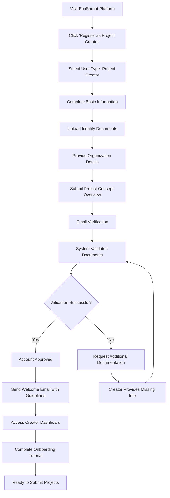

### 1.2 Project Development & Submission Workflow

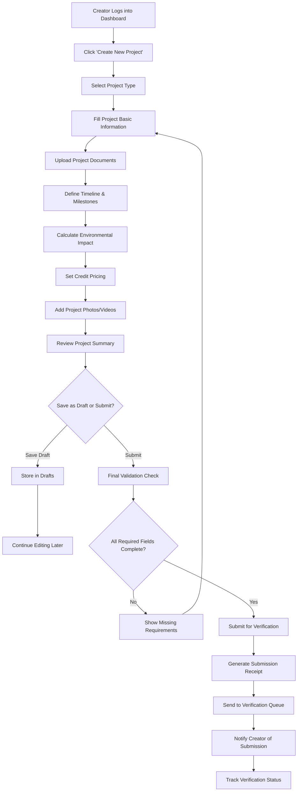

### 1.3 Project Management & Progress Reporting

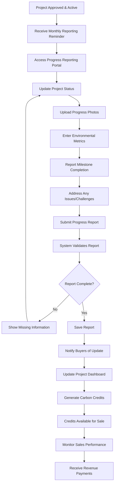

### 1.4 Revenue Management & Analytics

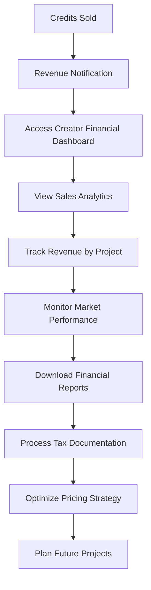

---

## 2. Credit Buyer Role Workflows

### 2.1 Credit Buyer Registration & Profile Setup

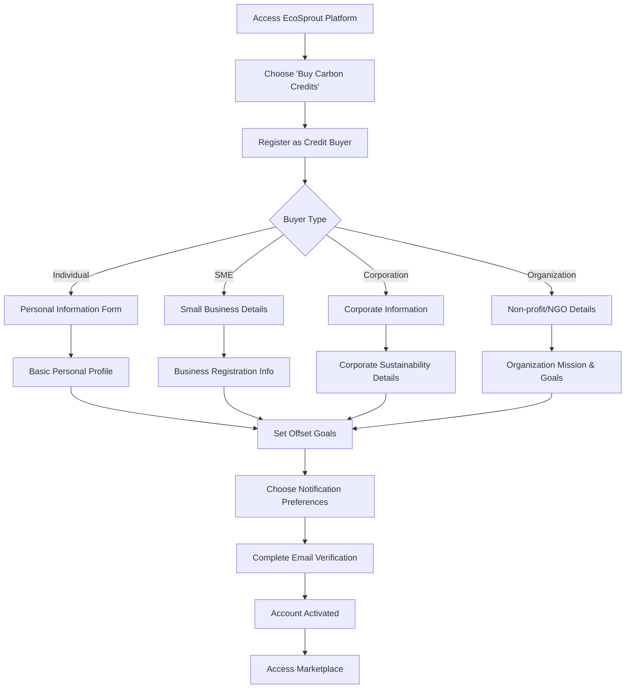

### 2.2 Credit Discovery & Selection Workflow

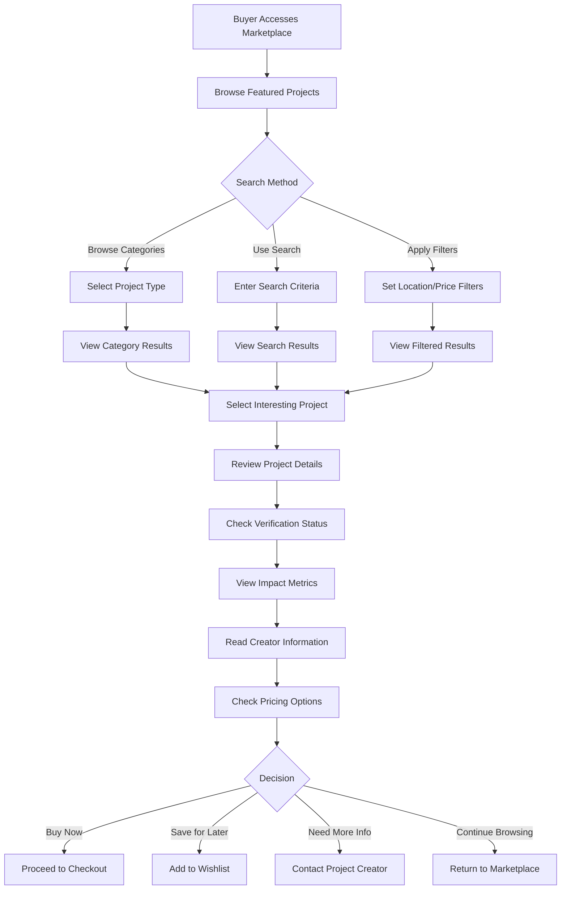

### 2.3 Purchase & Payment Workflow

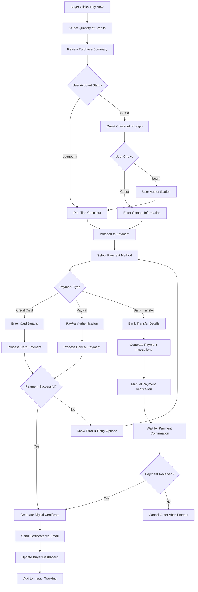

### 2.4 Impact Tracking & Management

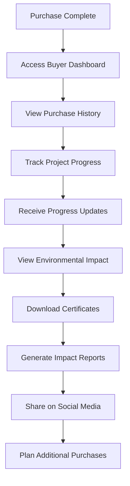

---

## 3. Verifier Role Workflows

### 3.1 Verifier Registration & Qualification

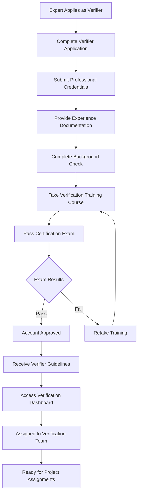

### 3.2 Project Assignment & Review Workflow

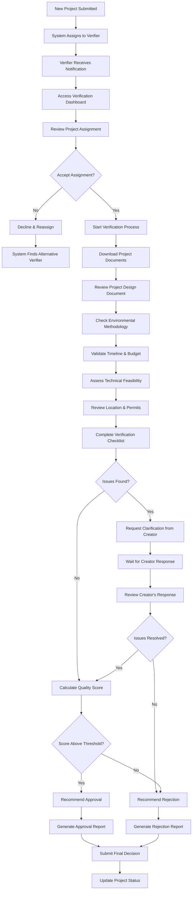

### 3.3 Ongoing Monitoring & Quality Assurance

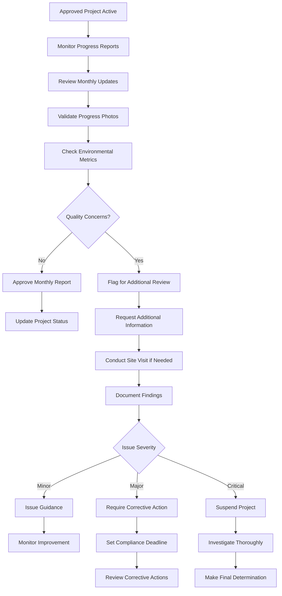

---

## 4. System Administrator Role Workflows

### 4.1 Platform Management & Configuration

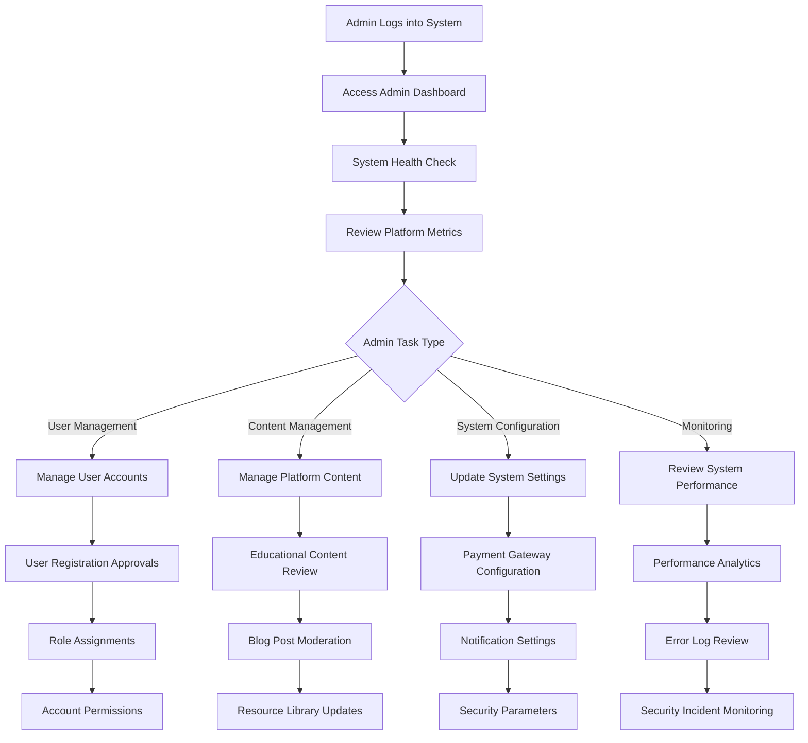

### 4.2 User Support & Issue Resolution

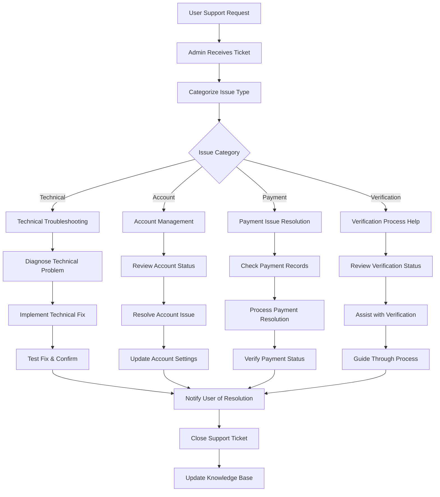

---

## 5. Cross-Role Interaction Workflows

### 5.1 Creator-Verifier Communication Workflow

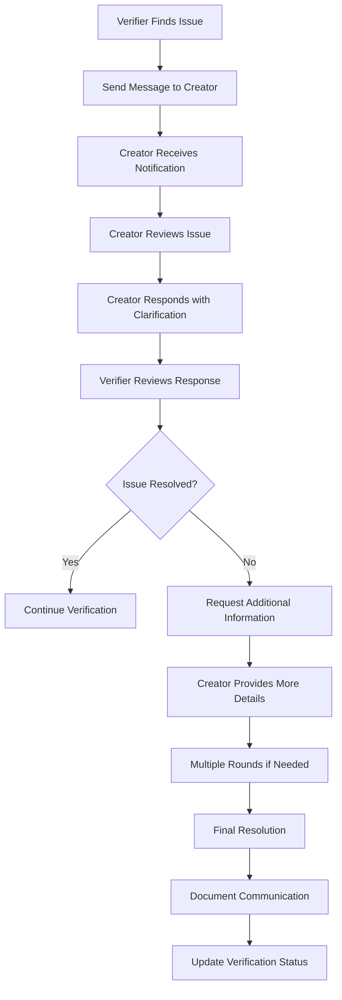

### 5.2 Buyer-Creator Direct Communication

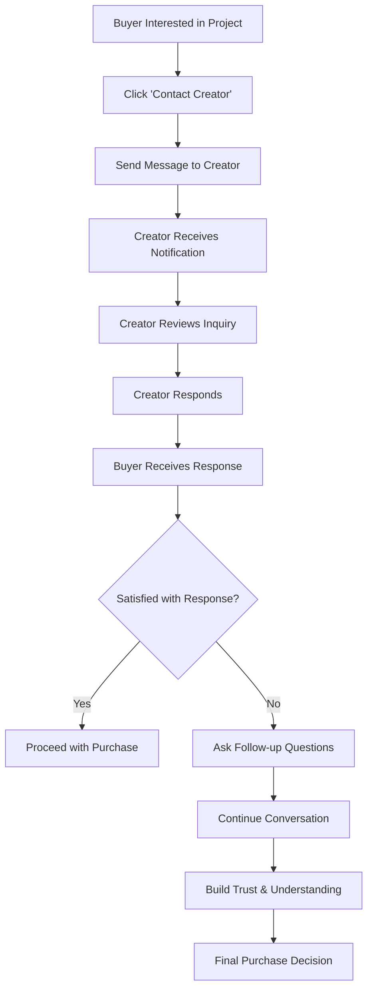

### 5.3 Escalation to Admin Workflow

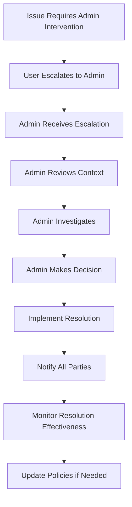

---

## 6. Role-Based Permissions Matrix

### 6.1 Access Control by Role

| Feature | Project Creator | Credit Buyer | Verifier | Admin |
| --- | --- | --- | --- | --- |
| ***Project Management*** |  |  |  |  |
| Create Projects | ✅ | ❌ | ❌ | ✅ |
| Submit for Verification | ✅ | ❌ | ❌ | ✅ |
| Edit Own Projects | ✅ | ❌ | ❌ | ✅ |
| View Project Analytics | ✅ | ❌ | ❌ | ✅ |
| ***Verification System*** |  |  |  |  |
| Verify Projects | ❌ | ❌ | ✅ | ✅ |
| Assign Verifiers | ❌ | ❌ | ❌ | ✅ |
| Override Decisions | ❌ | ❌ | ❌ | ✅ |
| ***Trading Marketplace*** |  |  |  |  |
| List Credits | ✅ | ❌ | ❌ | ✅ |
| Purchase Credits | ❌ | ✅ | ✅ | ✅ |
| View Sales Analytics | ✅ | ❌ | ❌ | ✅ |
| ***User Management*** |  |  |  |  |
| Manage Own Profile | ✅ | ✅ | ✅ | ✅ |
| Manage Other Users | ❌ | ❌ | ❌ | ✅ |
| View User Analytics | ❌ | ❌ | ❌ | ✅ |
| ***System Administration*** |  |  |  |  |
| System Configuration | ❌ | ❌ | ❌ | ✅ |
| Content Moderation | ❌ | ❌ | Limited | ✅ |
| Financial Reports | Own Only | Own Only | ❌ | ✅ |

### 6.2 Notification Preferences by Role

| Notification Type | Project Creator | Credit Buyer | Verifier | Admin |
| --- | --- | --- | --- | --- |
| Project Updates | ✅ Mandatory | ✅ Optional | ❌ | ✅ Optional |
| Verification Status | ✅ Mandatory | ❌ | ✅ Mandatory | ✅ Optional |
| Purchase Notifications | ✅ Mandatory | ✅ Mandatory | ❌ | ✅ Optional |
| System Alerts | ✅ Optional | ✅ Optional | ✅ Optional | ✅ Mandatory |
| Educational Content | ✅ Optional | ✅ Optional | ✅ Optional | ✅ Optional |

Each role has distinct workflows optimized for their specific needs and responsibilities within the EcoSprout ecosystem, ensuring efficient operation while maintaining security and compliance standards.