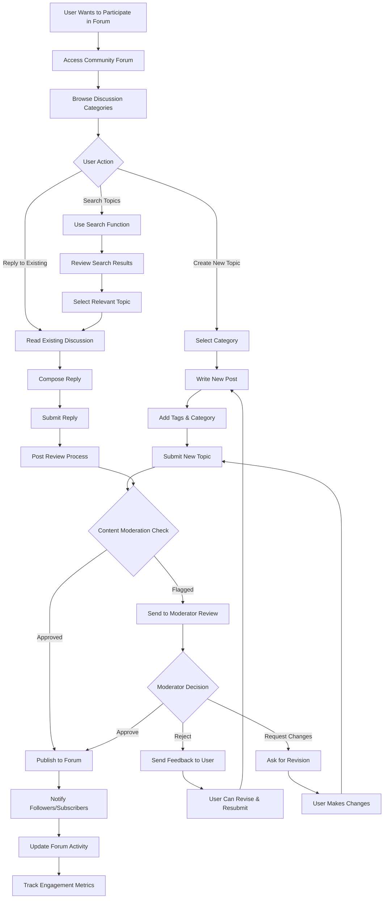
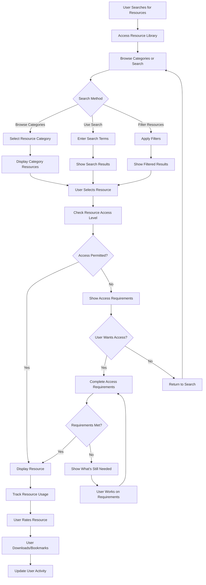

# Educational Hub

Created: August 15, 2025 2:54 PM

## Overview

The Educational Hub serves as the knowledge center of EcoSprout, providing learning resources, community engagement, and knowledge sharing to educate users about carbon credits, environmental projects, and sustainable practices.

---

## 1. Community Forum & Discussion Management

### Forum Categories:

- **Project Development**: Planning and implementation questions
- **Technical Support**: Platform usage and troubleshooting
- **Market Insights**: Carbon credit trends and opportunities
- **Success Stories**: Sharing achievements and lessons learned
- **Regional Discussions**: Location-specific topics and meetups
- **Policy & Regulations**: Regulatory updates and compliance

---

### Expert Categories:

- **Environmental Scientists**: Carbon sequestration, ecosystem impact
- **Project Managers**: Implementation strategies, timeline management
- **Legal Experts**: Regulatory compliance, documentation requirements
- **Financial Advisors**: Funding, cost management, ROI calculation
- **Technology Specialists**: Platform usage, digital tools, monitoring systems

---

## 2. Resource Library Management Workflow

### Resource Categories:

- **Templates & Forms**: Project registration templates, reporting forms
- **Calculators**: Carbon footprint calculators, impact measurement tools
- **Guidelines**: Step-by-step implementation guides
- **Research Papers**: Scientific studies and market analysis
- **Legal Documents**: Regulatory frameworks, compliance checklists
- **Video Library**: Tutorial videos, webinar recordings

---

## 

---

## System Integration & Performance Monitoring

### User Journey Tracking:

- **Learning Path Progress**: Which modules users complete
- **Engagement Patterns**: Peak usage times, preferred content types
- **Success Indicators**: Certification rates, practical application
- **Community Participation**: Forum activity, peer-to-peer learning

### Content Management System:

- **Version Control**: Track content updates and revisions
- **Access Control**: Role-based permissions for content creation
- **Content Lifecycle**: Creation, review, publication, updates, archival
- **Performance Monitoring**: Real-time analytics and optimization

### Integration with Main Platform:

- **User Profiles**: Learning achievements visible across platform
- **Project Applications**: Educational requirements for project creators
- **Buyer Education**: Understanding carbon credits before purchasing
- **Verification Training**: Specialized courses for verification teams

The Educational Hub serves as the foundation for building an informed, engaged community that understands carbon credits and environmental stewardship, supporting EcoSprout's mission to democratize access to carbon markets while maintaining quality and integrity.

streak , badge for comunity , active date iddi “ wow supiri”………resourses seen ek multilingual