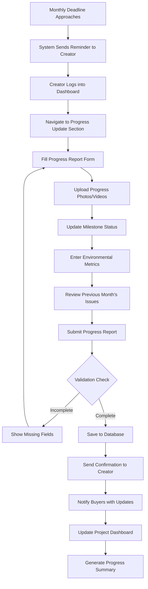
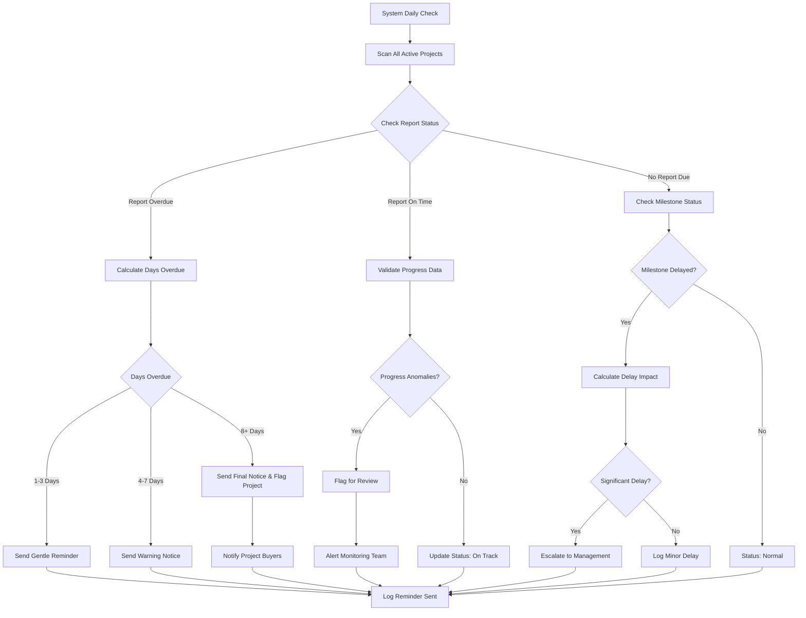
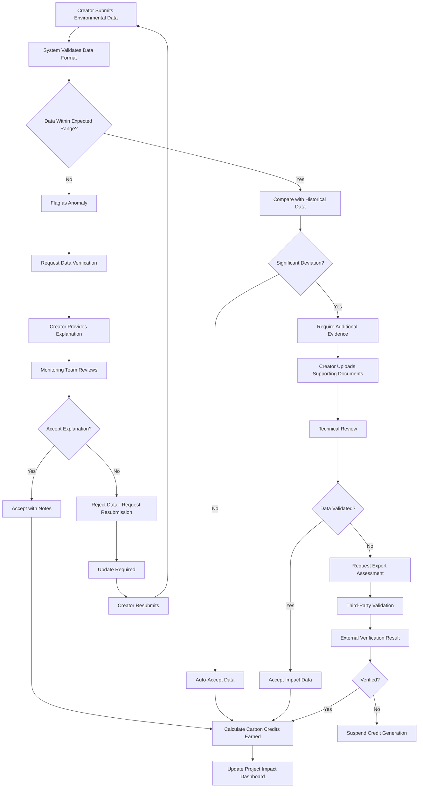
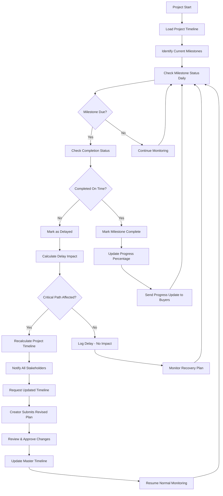
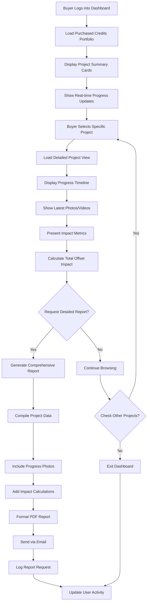
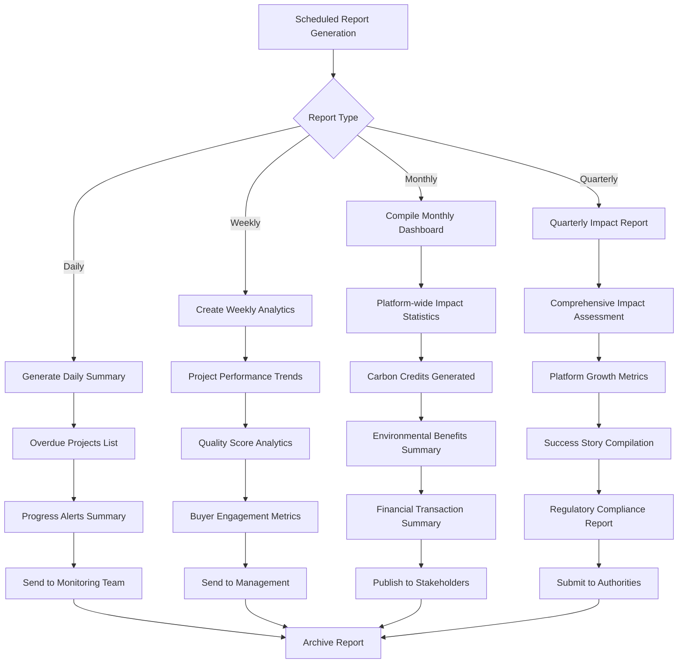

# Tracking System Workflows

Created: August 15, 2025 2:56 PM

## Overview

The Monitoring & Tracking System ensures project creators deliver on their promises throughout the project lifecycle. This is separate from the Verification System and focuses on ongoing performance validation and impact measurement.

---

## 1. Monthly Progress Update Submission Workflow

### Progress Report Components:

- **Activity Summary**: What was accomplished this month
- **Photo/Video Evidence**: Visual documentation of progress
- **Environmental Metrics**: Trees planted, CO2 reduced, energy generated
- **Milestone Updates**: Completed, in-progress, delayed milestones
- **Issues/Challenges**: Problems encountered and solutions implemented
- **Next Month's Plans**: Upcoming activities and goals

---

## 2. Automated Progress Monitoring & Alert System

### Alert Types:

- **Progress Reminders**: 7, 3, 1 days before deadline
- **Overdue Warnings**: Escalating severity for late reports
- **Milestone Delays**: When timelines are not met
- **Impact Shortfalls**: When environmental metrics fall below projections
- **Quality Concerns**: When photo evidence is insufficient

---

## 3. Impact Measurement & Validation Workflow

### Impact Metrics by Project Type:

- **Reforestation**: Trees planted, survival rate, CO2 sequestration
- **Solar Energy**: kWh generated, CO2 avoided, system uptime
- **Waste Management**: Waste processed, methane captured, recycling rates
- **Wind Energy**: Energy output, grid connection status, maintenance records

---

## 4. Milestone Tracking & Timeline Management

### Milestone Categories:

- **Setup Milestones**: Land acquisition, permits, equipment installation
- **Progress Milestones**: 25%, 50%, 75% completion markers
- **Impact Milestones**: First carbon credits generated, targets achieved
- **Verification Milestones**: Periodic third-party assessments

---

## 5. Buyer Impact Dashboard & Reporting

### Dashboard Features:

- **Portfolio Overview**: All purchased credits and their status
- **Project Cards**: Quick status, progress percentage, latest updates
- **Impact Summary**: Total CO2 offset, environmental benefits
- **Progress Timeline**: Visual representation of project milestones
- **Photo Gallery**: Latest evidence of project activities
- **Download Reports**: Detailed PDF reports for records

---

## 6. Automated Reporting & Analytics

### Report Recipients:

- **Daily**: Monitoring team, project managers
- **Weekly**: Department heads, senior management
- **Monthly**: All stakeholders, public dashboard
- **Quarterly**: Regulatory bodies, major investors

---

---

## System Integration & Data Flow

### Real-time Monitoring Components:

- **Automated Data Collection**: Regular pulls from project management systems
- **Photo Analysis**: AI-assisted verification of visual evidence
- **Anomaly Detection**: Statistical analysis to identify unusual patterns
- **Stakeholder Notifications**: Real-time alerts via email, SMS, platform notifications

### Performance Metrics:

- **Response Times**: How quickly issues are identified and addressed
- **Compliance Rates**: Percentage of projects meeting timeline and quality standards
- **Buyer Satisfaction**: Feedback scores on transparency and communication
- **Environmental Impact**: Actual vs. projected carbon reduction achievements

The Monitoring & Tracking System ensures that approved projects deliver on their promises, providing transparency to buyers and maintaining the integrity of the carbon credit marketplace.