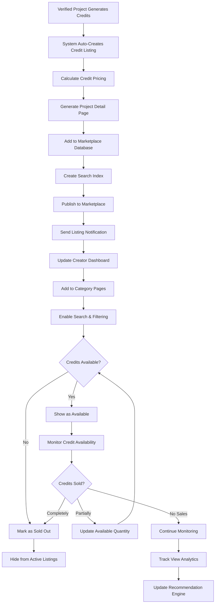
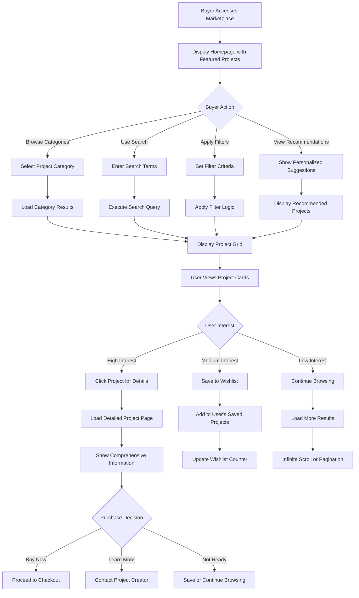
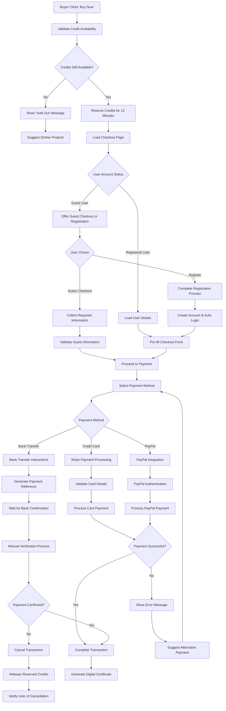
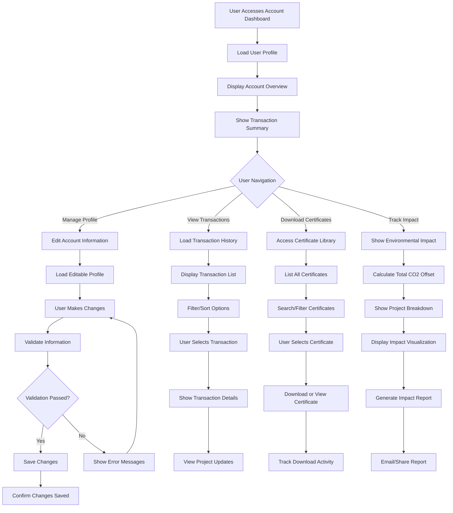
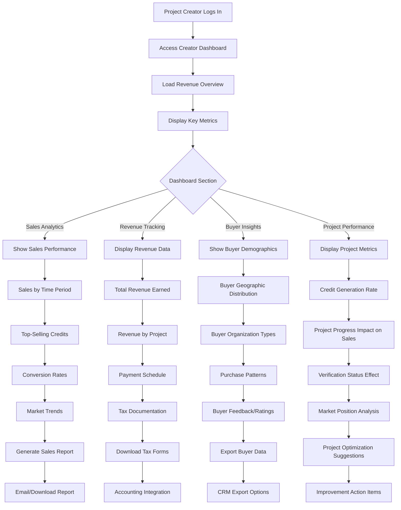
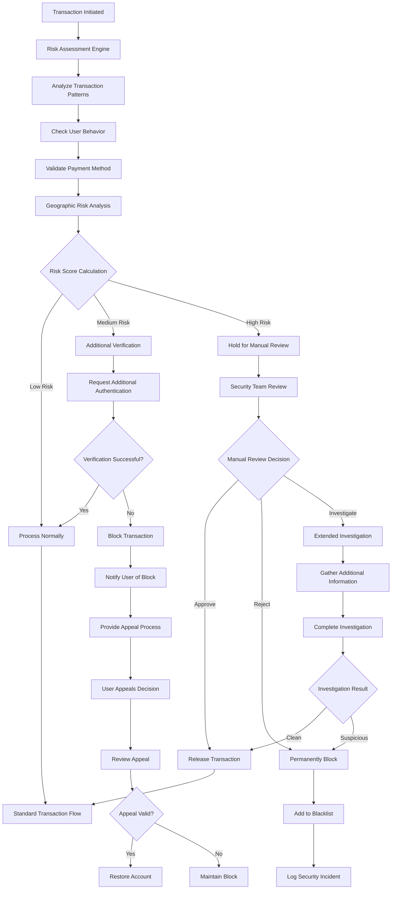
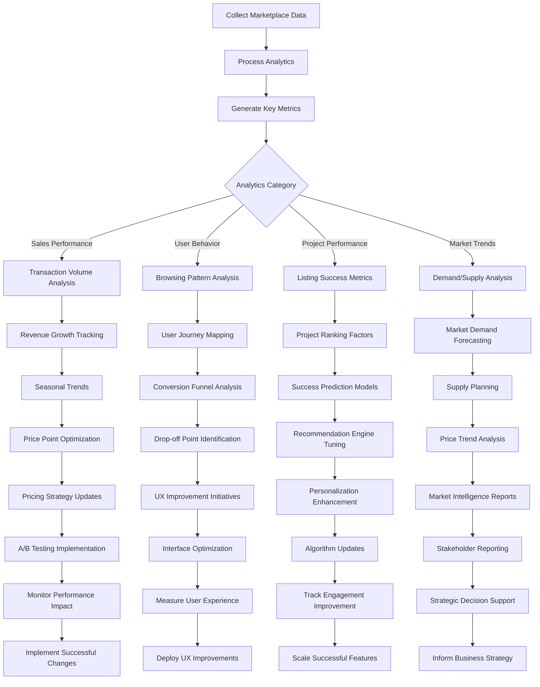

# Trading Marketplace Workflows

Created: August 15, 2025 2:59 PM

## Overview

The Trading Marketplace is the core commercial engine of EcoSprout, enabling secure transactions between carbon credit buyers and verified environmental projects. It provides browsing, purchasing, and transaction management capabilities.

---

## 1. Credit Listing & Project Display Workflow



### Credit Listing Components:

- **Project Information**: Name, location, type, creator details
- **Environmental Impact**: CO2 reduction, methodology, timeline
- **Pricing**: Price per credit, bulk discounts, total available
- **Verification Status**: Verification level, certification details
- **Visual Content**: Photos, videos, progress updates
- **Purchase Options**: Individual credits, bulk purchases, subscriptions

---

## 2. Credit Browsing & Search Workflow



### Search & Filter Options:

- **Project Type**: Reforestation, solar, wind, waste management
- **Location**: Province, district, specific regions
- **Price Range**: Min/max price per credit
- **Impact Type**: CO2 reduction, biodiversity, community benefits
- **Verification Level**: Basic, standard, premium verification
- **Availability**: In stock, coming soon, sold out

---

## 3. Secure Checkout & Payment Processing Workflow



### Payment Security Features:

- **PCI-DSS Compliance**: Secure credit card processing
- **SSL Encryption**: All payment data encrypted
- **3D Secure**: Additional authentication for cards
- **Fraud Detection**: Automated risk assessment
- **Escrow Protection**: Funds held until delivery confirmation
- **Refund Processing**: Automated refund capabilities

---

## 4. Digital Certificate Generation & Delivery

```mermaid
graph TD
    A[Payment Confirmed] --> B[Trigger Certificate Generation]
    B --> C[Collect Transaction Data]
    C --> D[Gather Project Information]
    D --> E[Calculate Environmental Impact]
    E --> F[Generate Unique Certificate ID]
    F --> G[Create PDF Certificate]

    G --> H[Add Digital Signature]
    H --> I[Include QR Code for Verification]
    I --> J[Embed Transaction Details]
    J --> K[Add Project Photos/Visuals]
    K --> L[Format Professional Layout]

    L --> M[Store Certificate in Database]
    M --> N[Link to User Account]
    N --> O[Send Email with Certificate]
    O --> P[SMS Notification (Optional)]

    P --> Q[Update Buyer Dashboard]
    Q --> R[Record in Transaction History]
    R --> S[Notify Project Creator]
    S --> T[Update Credit Availability]
    T --> U[Generate Analytics Data]

    U --> V{Certificate Delivery Status}
    V -->|Successful| W[Mark as Delivered]
    V -->|Failed| X[Retry Delivery Process]

    X --> Y[Alternative Delivery Method]
    Y --> Z[Manual Intervention if Needed]

    W --> AA[Transaction Complete]
    Z --> AA

```

### Certificate Components:

- **Buyer Information**: Name, organization, contact details
- **Project Details**: Name, location, type, impact metrics
- **Credit Specifications**: Quantity, price, CO2 equivalent
- **Verification Data**: Verification status, methodologies used
- **Unique Identifiers**: Certificate ID, transaction hash, QR code
- **Legal Information**: Terms, conditions, validity period

---

## 6. Transaction History & Account Management



### Account Management Features:

- **Transaction History**: Complete purchase records with search/filter
- **Certificate Library**: All certificates in one secure location
- **Impact Tracking**: Real-time updates on environmental benefits
- **Profile Management**: Personal and organizational information
- **Notification Preferences**: Email, SMS, platform notifications
- **Security Settings**: Password, two-factor authentication

---

## 7. Project Creator Revenue & Analytics Dashboard



### Creator Dashboard Metrics:

- **Revenue Tracking**: Total earnings, payment schedules, tax reports
- **Sales Performance**: Credits sold, conversion rates, trending data
- **Buyer Analytics**: Demographics, organization types, feedback
- **Project Impact**: How project progress affects sales
- **Market Position**: Competitive analysis, pricing optimization
- **Growth Opportunities**: Suggestions for increasing sales

---

## 8. Fraud Prevention & Security Monitoring



### Security Measures:

- **Real-time Monitoring**: Continuous transaction analysis
- **Behavioral Analytics**: Detect unusual user patterns
- **Device Fingerprinting**: Track device and location consistency
- **Payment Verification**: Multiple payment validation layers
- **Machine Learning**: Adaptive fraud detection algorithms
- **Manual Review**: Human oversight for complex cases

---

## 9. Marketplace Performance Analytics & Optimization



### Performance Metrics:

- **Transaction Metrics**: Volume, value, conversion rates, payment success
- **User Engagement**: Page views, time on site, return visits, searches
- **Project Success**: Listing views, sales rate, time to sell out
- **Market Health**: Supply/demand balance, price trends, growth rates
- **Platform Efficiency**: Search effectiveness, checkout completion, support tickets

---

## System Integration & Real-time Features

### Real-time Components:

- **Live Inventory**: Credit availability updates instantly across platform
- **Price Updates**: Dynamic pricing based on demand and availability
- **Notification System**: Real-time alerts for purchases, new listings
- **Chat Support**: Live customer service during transactions
- **Progress Updates**: Real-time project progress affects listing information

### Payment System Integration:

- **Multi-gateway Support**: Stripe, PayPal, local payment methods
- **Currency Support**: LKR primary, USD/EUR for international buyers
- **Escrow Services**: Secure fund holding until delivery
- **Automated Reconciliation**: Daily financial reporting and matching
- **Compliance Reporting**: Automated tax and regulatory reporting

### Mobile Optimization:

- **Responsive Design**: Full functionality on all device sizes
- **Touch-optimized**: Easy browsing and purchasing on mobile
- **Fast Loading**: Optimized images and streamlined checkout
- **Offline Capability**: Basic browsing without internet connection
- **Push Notifications**: Mobile alerts for important updates

The Trading Marketplace serves as the commercial heart of EcoSprout, enabling secure, transparent, and efficient carbon credit transactions while maintaining trust and providing comprehensive analytics for all stakeholders.