# User Roles & Interactions Diagram

Created: August 15, 2025 3:48 PM

## Comprehensive Platform Overview

```mermaid
graph TB
    subgraph "EcoSprout Platform Ecosystem"

        subgraph "Core Systems"
            PRS[Project Registration System]
            VS[Verification System]
            TM[Trading Marketplace]
            MTS[Monitoring & Tracking System]
            EH[Educational Hub]
            DB[(EcoSprout Database)]
        end

        subgraph "Project Creator Role"
            PC[👨‍🌱 Project Creator]
            PC_Tasks["• Create environmental projects<br/>• Submit for verification<br/>• Monitor progress<br/>• Report monthly updates<br/>• Manage revenue<br/>• Upload documentation"]
            PC_Dashboard[Creator Dashboard]
        end

        subgraph "Credit Buyer Role"
            CB[🏢 Credit Buyer]
            CB_Tasks["• Browse & search projects<br/>• Purchase carbon credits<br/>• Track environmental impact<br/>• Download certificates<br/>• Manage transactions<br/>• View portfolio"]
            CB_Dashboard[Buyer Dashboard]
        end

        subgraph "Verifier Role"
            VF[🔍 Verifier]
            VF_Tasks["• Review project submissions<br/>• Conduct verification process<br/>• Approve/reject projects<br/>• Monitor project quality<br/>• Communicate with creators<br/>• Generate reports"]
            VF_Dashboard[Verifier Dashboard]
        end

        subgraph "System Admin Role"
            SA[⚙️ System Administrator]
            SA_Tasks["• Manage platform settings<br/>• User account management<br/>• Content moderation<br/>• System monitoring<br/>• Technical support<br/>• Policy enforcement"]
            SA_Dashboard[Admin Dashboard]
        end

        subgraph "External Services"
            STRIPE[💳 Stripe Payment]
            CLERK[🔐 Clerk Authentication]
            CLOUDINARY[☁️ Cloudinary Storage]
            POSTMARK[📧 Postmark Email]
            CONVEX[🗄️ Convex Backend]
        end

        subgraph "Workflows & Interactions"
            W1[Project Submission Flow]
            W2[Verification Process]
            W3[Trading & Payment]
            W4[Progress Monitoring]
            W5[Educational Learning]
        end
    end

    %% Project Creator Interactions
    PC --> PC_Tasks
    PC_Tasks --> PRS
    PC --> PC_Dashboard
    PC_Dashboard --> MTS
    PC --> W1
    PC --> W4
    PC --> EH

    %% Credit Buyer Interactions
    CB --> CB_Tasks
    CB_Tasks --> TM
    CB --> CB_Dashboard
    CB_Dashboard --> MTS
    CB --> W3
    CB --> EH

    %% Verifier Interactions
    VF --> VF_Tasks
    VF_Tasks --> VS
    VF --> VF_Dashboard
    VF_Dashboard --> MTS
    VF --> W2
    VF --> EH

    %% Admin Interactions
    SA --> SA_Tasks
    SA_Tasks --> PRS
    SA_Tasks --> VS
    SA_Tasks --> TM
    SA_Tasks --> MTS
    SA_Tasks --> EH
    SA --> SA_Dashboard

    %% Cross-Role Communications
    PC -.->|"Clarifications<br/>& Updates"| VF
    VF -.->|"Review Results<br/>& Feedback"| PC
    CB -.->|"Project Inquiries<br/>& Questions"| PC
    PC -.->|"Project Information<br/>& Updates"| CB
    PC -.->|"Technical Support<br/>& Issues"| SA
    CB -.->|"Account Support<br/>& Issues"| SA
    VF -.->|"Process Issues<br/>& Escalations"| SA

    %% System Workflows
    W1 --> VS
    W2 --> TM
    W3 --> MTS
    W4 --> EH
    W5 --> DB

    %% Core System Interconnections
    PRS --> DB
    VS --> DB
    TM --> DB
    MTS --> DB
    EH --> DB

    %% External Service Integrations
    TM --> STRIPE
    PRS --> CLERK
    VS --> CLERK
    TM --> CLERK
    MTS --> CLOUDINARY
    PRS --> CLOUDINARY
    TM --> POSTMARK
    VS --> POSTMARK
    MTS --> POSTMARK
    DB --> CONVEX

    %% Data Flow Indicators
    PRS -->|"Project Data"| VS
    VS -->|"Verified Projects"| TM
    TM -->|"Active Projects"| MTS
    MTS -->|"Progress Data"| TM

    %% Styling
    classDef userRole fill:#e1f5fe,stroke:#01579b,stroke-width:2px
    classDef system fill:#f3e5f5,stroke:#4a148c,stroke-width:2px
    classDef external fill:#fff3e0,stroke:#e65100,stroke-width:2px
    classDef workflow fill:#e8f5e8,stroke:#2e7d32,stroke-width:2px
    classDef dashboard fill:#fff8e1,stroke:#f57f17,stroke-width:2px

    class PC,CB,VF,SA userRole
    class PRS,VS,TM,MTS,EH,DB system
    class STRIPE,CLERK,CLOUDINARY,POSTMARK,CONVEX external
    class W1,W2,W3,W4,W5 workflow
    class PC_Dashboard,CB_Dashboard,VF_Dashboard,SA_Dashboard dashboard

```



## Role Interaction Matrix

| From ↓ / To → | Project Creator | Credit Buyer | Verifier | System Admin |
| --- | --- | --- | --- | --- |
| **Project Creator** | - | Project Info<br/>Updates | Clarifications<br/>Documents | Technical Support<br/>Issues |
| **Credit Buyer** | Project Inquiries<br/>Questions | - | - | Account Support<br/>Purchase Issues |
| **Verifier** | Review Results<br/>Feedback | - | Peer Consultation | Process Issues<br/>Escalations |
| **System Admin** | Account Management<br/>Policy Updates | Account Management<br/>Platform Updates | Training<br/>Quality Reviews | System Coordination |

## System Access Permissions

```mermaid
graph LR
    subgraph "Permission Levels"

        subgraph "Project Creator Access"
            PC_PRS[✅ Project Registration]
            PC_MTS[✅ Progress Reporting]
            PC_TM[✅ Revenue Analytics]
            PC_EH[✅ Educational Content]
            PC_VS[❌ Verification System]
            PC_SA[❌ Admin Functions]
        end

        subgraph "Credit Buyer Access"
            CB_TM[✅ Trading Marketplace]
            CB_MTS[✅ Impact Tracking]
            CB_EH[✅ Educational Content]
            CB_PRS[❌ Project Creation]
            CB_VS[❌ Verification System]
            CB_SA[❌ Admin Functions]
        end

        subgraph "Verifier Access"
            VF_VS[✅ Verification System]
            VF_MTS[✅ Progress Monitoring]
            VF_EH[✅ Educational Content]
            VF_PRS[❌ Project Creation]
            VF_TM[❌ Trading Analytics]
            VF_SA[❌ Admin Functions]
        end

        subgraph "System Admin Access"
            SA_ALL[✅ All Systems]
            SA_USER[✅ User Management]
            SA_CONFIG[✅ System Configuration]
            SA_REPORTS[✅ All Analytics]
            SA_SUPPORT[✅ Technical Support]
        end
    end

```



## Workflow Integration Overview

### Primary User Journeys:

1. **Project Creator Journey:**
    
    ```
    Registration → Project Creation → Verification → Approval →
    Progress Monitoring → Credit Generation → Revenue Management
    
    ```
    
2. **Credit Buyer Journey:**
    
    ```
    Registration → Education → Project Discovery → Purchase →
    Certificate Receipt → Impact Tracking → Repeat Purchase
    
    ```
    
3. **Verifier Journey:**
    
    ```
    Qualification → Training → Assignment → Review Process →
    Decision → Monitoring → Quality Assurance
    
    ```
    
4. **System Admin Journey:**
    
    ```
    Platform Monitoring → User Support → System Configuration →
    Quality Control → Policy Updates → Performance Analysis
    
    ```
    

### Cross-Role Dependencies:

- **Project Creators** depend on **Verifiers** for project approval
- **Credit Buyers** depend on **Project Creators** for verified credits
- **Verifiers** depend on **Project Creators** for quality documentation
- **All Roles** depend on **System Admins** for platform functionality
- **System Admins** coordinate between all roles for optimal platform operation

### Communication Channels:

- **Direct Messaging**: Built-in platform messaging system
- **Email Notifications**: Automated updates via Postmark
- **Dashboard Alerts**: Real-time notifications in user dashboards
- **Forum Discussions**: Community-based knowledge sharing
- **Support Tickets**: Formal issue resolution process

This comprehensive diagram shows how all user roles interact within the EcoSprout ecosystem, their specific responsibilities, access permissions, and the flow of information between different system components.