# Verification System

Created: August 15, 2025 2:54 PM

## 1. Project Submission to Verification Workflow

### Detailed Steps:

1. **Project Creator Action**: Submit completed project with all documentation
2. **System Validation**: Check for required documents (PDD, location data, timeline)
3. **Queue Assignment**: Auto-assign based on project type and verifier workload
4. **Notification**: Email alerts to assigned verification team
5. **Status Update**: Project status changes to "Pending Verification"

---

## 2. Verification Assignment & Queue Management Workflow

### Key Features:

- **Workload Balancing**: Automatic distribution based on current caseload
- **Specialization Matching**: Route projects to verifiers with relevant expertise
- **Manual Override**: Admin can reassign if needed
- **Acceptance Tracking**: Verifiers must confirm acceptance

---

## 3. Document Review & Verification Process Workflow

```mermaid
graph TD
    A[Verifier Starts Review] --> B[Open Verification Checklist]
    B --> C[Review Project Documentation]
    C --> D[Use Online Document Viewer]
    D --> E[Add Annotations & Notes]
    E --> F[Complete Checklist Items]
    F --> G{All Criteria Met?}

    G -->|No| H[Identify Issues]
    H --> I[Request Clarification/Revision]
    I --> J[Send Message to Creator]
    J --> K[Update Status: Revision Required]
    K --> L[Wait for Creator Response]
    L --> M[Creator Provides Updates]
    M --> C

    G -->|Yes| N[Calculate Quality Score]
    N --> O{Score ≥ Minimum Threshold?}
    O -->|No| P[Reject with Detailed Feedback]
    O -->|Yes| Q[Approve Project]

    P --> R[Generate Rejection Report]
    Q --> S[Generate Approval Certificate]

    R --> T[Send to Creator & Admin]
    S --> T
    T --> U[Update Project Status]

```

### Verification Checklist Components:

- **Environmental Impact**: Carbon reduction calculations, methodology validation
- **Project Feasibility**: Timeline, budget, technical approach
- **Documentation Quality**: Completeness, accuracy, compliance
- **Location Verification**: Geographic data, land rights, accessibility
- **Sustainability**: Long-term viability, maintenance plans

---

## 4. Communication Between Verifier & Creator Workflow

### Communication Features:

- **Threaded Conversations**: Organized by topic/issue
- **File Attachments**: Support for documents, images, videos
- **Priority Levels**: Urgent, normal, low priority messaging
- **Auto-Notifications**: Email alerts for new messages
- **Read Receipts**: Confirmation when messages are viewed

---

## 5. Approval/Rejection Decision Workflow

### Decision Outcomes:

- **Approved**: Credits created, project goes live in marketplace
- **Rejected**: Detailed feedback, option to revise and resubmit
- **Conditional Approval**: Minor changes required before final approval
- **Suspended**: Major issues requiring significant revision

---

## 6. Audit Trail & Reporting Workflow

### Audit Trail Components:

- **User Actions**: Login, document access, decisions made
- **Timeline Tracking**: Start/end times, duration of reviews
- **Decision History**: Approval/rejection reasons, score changes
- **Communication Log**: All messages, file exchanges
- **System Events**: Automatic notifications, status changes

---

## System Integration Points

### Database Operations:

- **Real-time Updates**: Status changes propagated instantly
- **Backup Procedures**: Daily automated backups of verification data
- **Data Integrity**: Validation rules prevent inconsistent states

### External Integrations:

- **Email System**: Postmark for reliable notifications
- **File Storage**: Cloudinary for secure document management
- **Payment Gateway**: Stripe for financial transactions
- **Authentication**: Clerk for secure user management

### Performance Monitoring:

- **Response Times**: Track verification processing speeds
- **Success Rates**: Monitor approval/rejection ratios
- **User Satisfaction**: Regular feedback collection
- **System Health**: Automated monitoring and alerts