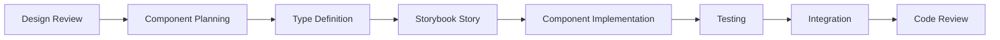

# EcoSprout Frontend Development Plan
*Comprehensive React/Next.js 15 Implementation Strategy*

Created: September 27, 2025
Framework: Next.js 15 with TypeScript
UI Library: shadcn/ui with Tailwind CSS
State Management: Zustand

---

## Table of Contents

1. [Development Methodology](#development-methodology)
2. [Folder Structure Architecture](#folder-structure-architecture)
3. [shadcn/ui Integration Strategy](#shadcnui-integration-strategy)
4. [Theme Customization](#theme-customization)
5. [Component Architecture](#component-architecture)
6. [TypeScript Implementation](#typescript-implementation)
7. [State Management Strategy](#state-management-strategy)
8. [Development Workflow](#development-workflow)
9. [Testing Strategy](#testing-strategy)
10. [Performance Optimization](#performance-optimization)
11. [Accessibility Implementation](#accessibility-implementation)
12. [Implementation Timeline](#implementation-timeline)

---

## Development Methodology

### Core Principles

#### 1. **Minimalistic Component-Driven Development (CDD)**
- Build clean, simple UI components in isolation using Storybook
- Focus on essential functionality with minimal visual complexity
- Leverage existing shadcn/ui components (including the existing sidebar component)
- Maintain a streamlined component library with consistent minimalistic design
- Ensure reusability across dashboards with a unified simple aesthetic

#### 2. **Mobile-First Responsive Design**
```typescript
// Responsive breakpoint strategy
const breakpoints = {
  sm: '640px',   // Mobile landscape
  md: '768px',   // Tablet
  lg: '1024px',  // Laptop
  xl: '1280px',  // Desktop
  '2xl': '1536px' // Large desktop
};

// Minimalistic component example with mobile-first approach
const DashboardGrid = () => (
  <div className="grid gap-6 grid-cols-1 sm:grid-cols-2 lg:grid-cols-4">
    {metrics.map((metric) => (
      <Card key={metric.id} className="p-4 bg-white border-0 shadow-sm">
        <div className="flex items-center justify-between">
          <div>
            <p className="text-sm text-gray-600">{metric.title}</p>
            <p className="text-2xl font-semibold">{metric.value}</p>
          </div>
          <metric.icon className="h-6 w-6 text-gray-400" />
        </div>
      </Card>
    ))}
  </div>
);
```

#### 3. **Performance-First Architecture**
- Implement React 19 concurrent features
- Use Server Components for data fetching
- Optimize bundle splitting and lazy loading
- Implement virtual scrolling for large datasets

#### 4. **Accessibility-First Design**
- WCAG 2.1 AA compliance from day one
- Semantic HTML and proper ARIA attributes
- Keyboard navigation support
- Screen reader optimization

#### 5. **Type-Safe Development**
- Strict TypeScript configuration
- End-to-end type safety from API to UI
- Custom type guards and validation
- Runtime type checking with Zod

### Development Workflow

#### 1. **Feature Development Process**


#### 2. **Code Organization Standards**
```typescript
// File naming conventions with existing shadcn components
// ✅ Good
components/ui/sidebar.tsx          // Existing shadcn sidebar component
components/ui/Button.tsx
components/dashboard/MetricCard.tsx
components/layout/DashboardLayout.tsx  // Uses existing sidebar
hooks/useProjectData.ts
types/project.types.ts
utils/formatCurrency.ts

// ❌ Bad
components/sidebar.jsx             // Don't create custom sidebar
components/button.jsx
components/metric-card.tsx
hooks/project-data.js
types/projectTypes.ts
utils/format_currency.ts
```

#### 3. **Git Workflow**
- Feature branches from `dev/main`
- Conventional commit messages
- Automated testing on PRs
- Code review requirements
- Automated deployment to staging

---

## Folder Structure Architecture

### Complete Project Structure

```
apps/web/
├── app/                           # Next.js 15 App Router
│   ├── (auth)/                    # Route groups
│   │   ├── login/
│   │   └── register/
│   ├── (dashboard)/
│   │   ├── creator/
│   │   │   ├── dashboard/
│   │   │   ├── projects/
│   │   │   ├── reports/
│   │   │   └── revenue/
│   │   ├── buyer/
│   │   │   ├── dashboard/
│   │   │   ├── marketplace/
│   │   │   ├── portfolio/
│   │   │   └── certificates/
│   │   ├── verifier/
│   │   │   ├── dashboard/
│   │   │   ├── queue/
│   │   │   ├── review/
│   │   │   └── completed/
│   │   └── admin/
│   │       ├── dashboard/
│   │       ├── users/
│   │       ├── analytics/
│   │       └── settings/
│   ├── api/                       # API routes
│   ├── globals.css
│   ├── layout.tsx
│   └── loading.tsx
├── components/                    # Component library
│   ├── ui/                        # shadcn/ui components (including existing sidebar)
│   │   ├── Button.tsx
│   │   ├── Card.tsx
│   │   ├── Input.tsx
│   │   ├── Table.tsx
│   │   ├── sidebar.tsx            # Existing shadcn sidebar component
│   │   └── [50+ more components]
│   ├── layout/                    # Layout components
│   │   ├── Header.tsx
│   │   ├── DashboardLayout.tsx    # Uses existing shadcn sidebar
│   │   ├── Navigation.tsx         # Built with shadcn sidebar components
│   │   └── Footer.tsx
│   ├── dashboard/                 # Dashboard-specific components
│   │   ├── common/                # Shared dashboard components
│   │   │   ├── MetricCard.tsx
│   │   │   ├── StatusBadge.tsx
│   │   │   ├── ProgressBar.tsx
│   │   │   └── ActivityFeed.tsx
│   │   ├── creator/               # Project creator components
│   │   │   ├── ProjectWizard.tsx
│   │   │   ├── ProgressReport.tsx
│   │   │   ├── RevenueChart.tsx
│   │   │   └── ProjectCard.tsx
│   │   ├── buyer/                 # Credit buyer components
│   │   │   ├── MarketplaceGrid.tsx
│   │   │   ├── PurchaseModal.tsx
│   │   │   ├── CertificateCard.tsx
│   │   │   └── ImpactDashboard.tsx
│   │   ├── verifier/              # Verifier components
│   │   │   ├── VerificationQueue.tsx
│   │   │   ├── DocumentViewer.tsx
│   │   │   ├── ReviewPanel.tsx
│   │   │   └── ChecklistItem.tsx
│   │   └── admin/                 # Admin components
│   │       ├── UserManagement.tsx
│   │       ├── SystemMetrics.tsx
│   │       ├── AnalyticsChart.tsx
│   │       └── ConfigPanel.tsx
│   ├── forms/                     # Form components
│   │   ├── ProjectForm.tsx
│   │   ├── ProfileForm.tsx
│   │   ├── PaymentForm.tsx
│   │   └── VerificationForm.tsx
│   ├── charts/                    # Chart components
│   │   ├── LineChart.tsx
│   │   ├── BarChart.tsx
│   │   ├── PieChart.tsx
│   │   └── AreaChart.tsx
│   └── features/                  # Feature-specific components
│       ├── auth/
│       ├── marketplace/
│       ├── verification/
│       └── monitoring/
├── hooks/                         # Custom React hooks
│   ├── api/                       # API hooks
│   │   ├── useProjects.ts
│   │   ├── useCredits.ts
│   │   ├── useVerification.ts
│   │   └── useAnalytics.ts
│   ├── ui/                        # UI hooks
│   │   ├── useToast.ts
│   │   ├── useModal.ts
│   │   ├── useLocalStorage.ts
│   │   └── useDebounce.ts
│   └── dashboard/                 # Dashboard hooks
│       ├── useDashboardMetrics.ts
│       ├── useRealtimeUpdates.ts
│       └── useFilters.ts
├── lib/                           # Utility libraries
│   ├── utils.ts                   # General utilities
│   ├── validations.ts             # Zod schemas
│   ├── constants.ts               # App constants
│   ├── auth.ts                    # Authentication utilities
│   ├── api.ts                     # API client configuration
│   └── formatters.ts              # Data formatters
├── store/                         # Zustand stores
│   ├── authStore.ts
│   ├── dashboardStore.ts
│   ├── marketplaceStore.ts
│   ├── verificationStore.ts
│   └── uiStore.ts
├── types/                         # TypeScript type definitions
│   ├── api.types.ts               # API response types
│   ├── dashboard.types.ts         # Dashboard-specific types
│   ├── ui.types.ts                # UI component types
│   ├── auth.types.ts              # Authentication types
│   └── global.types.ts            # Global type definitions
├── styles/                        # Styling files
│   ├── globals.css                # Global styles + shadcn vars
│   ├── components.css             # Component-specific styles
│   └── dashboard.css              # Dashboard-specific styles
├── config/                        # Configuration files
│   ├── site.ts                    # Site configuration
│   ├── dashboard.ts               # Dashboard configuration
│   └── navigation.ts              # Navigation configuration
└── stories/                       # Storybook stories
    ├── components/
    ├── pages/
    └── layouts/
```

### Key Organizational Principles

#### 1. **Feature-Based Organization**
- Components grouped by domain (dashboard, auth, marketplace)
- Co-located related files (component + test + story)
- Clear separation of concerns

#### 2. **Scalable Structure**
- Easily extensible for new features
- Clear import paths with aliases
- Consistent naming conventions

#### 3. **Type Safety**
- Centralized type definitions
- API response types
- Component prop types

---

## shadcn/ui Integration Strategy

### Complete Component Integration Plan

#### Phase 1: Core Components (Week 1)
```bash
# Essential UI components
npx shadcn-ui@latest add button
npx shadcn-ui@latest add input
npx shadcn-ui@latest add label
npx shadcn-ui@latest add card
npx shadcn-ui@latest add badge
npx shadcn-ui@latest add avatar
npx shadcn-ui@latest add separator
npx shadcn-ui@latest add skeleton
```

#### Phase 2: Form Components (Week 2)
```bash
# Form and interaction components
npx shadcn-ui@latest add form
npx shadcn-ui@latest add select
npx shadcn-ui@latest add textarea
npx shadcn-ui@latest add checkbox
npx shadcn-ui@latest add radio-group
npx shadcn-ui@latest add switch
npx shadcn-ui@latest add slider
npx shadcn-ui@latest add progress
```

#### Phase 3: Navigation Components (Week 3) - Sidebar Already Available
```bash
# Navigation and layout components (sidebar already implemented)
# Existing: sidebar.tsx at /components/ui/sidebar.tsx
npx shadcn-ui@latest add navigation-menu
npx shadcn-ui@latest add dropdown-menu
npx shadcn-ui@latest add breadcrumb
npx shadcn-ui@latest add tabs
npx shadcn-ui@latest add pagination
npx shadcn-ui@latest add command
npx shadcn-ui@latest add sheet
```

#### Phase 4: Data Display (Week 4)
```bash
# Data visualization components
npx shadcn-ui@latest add table
npx shadcn-ui@latest add calendar
npx shadcn-ui@latest add chart
npx shadcn-ui@latest add tooltip
npx shadcn-ui@latest add popover
npx shadcn-ui@latest add hover-card
npx shadcn-ui@latest add accordion
npx shadcn-ui@latest add collapsible
```

#### Phase 5: Feedback Components (Week 5)
```bash
# User feedback components
npx shadcn-ui@latest add alert
npx shadcn-ui@latest add alert-dialog
npx shadcn-ui@latest add dialog
npx shadcn-ui@latest add drawer
npx shadcn-ui@latest add toast
npx shadcn-ui@latest add sonner
```

#### Phase 6: Advanced Components (Week 6)
```bash
# Advanced layout and utility components
npx shadcn-ui@latest add scroll-area
npx shadcn-ui@latest add resizable
npx shadcn-ui@latest add aspect-ratio
npx shadcn-ui@latest add context-menu
npx shadcn-ui@latest add menubar
```

### Custom Component Extensions

#### 1. **Enhanced Metric Card**
```typescript
// components/dashboard/common/MetricCard.tsx
import { Card, CardContent, CardHeader, CardTitle } from '@/components/ui/card';
import { Badge } from '@/components/ui/badge';
import { cn } from '@/lib/utils';
import { LucideIcon } from 'lucide-react';

interface MetricCardProps {
  title: string;
  value: string | number;
  change?: string;
  changeType?: 'positive' | 'negative' | 'neutral';
  icon: LucideIcon;
  className?: string;
  loading?: boolean;
}

export const MetricCard: React.FC<MetricCardProps> = ({
  title,
  value,
  change,
  changeType = 'neutral',
  icon: Icon,
  className,
  loading = false
}) => {
  const changeColors = {
    positive: 'text-mountain-meadow bg-mountain-meadow/10',
    negative: 'text-red-600 bg-red-50',
    neutral: 'text-dark bg-gray-50'
  };

  if (loading) {
    return (
      <Card className={cn('p-6', className)}>
        <CardHeader className="pb-2">
          <div className="h-4 w-24 bg-gray-200 rounded animate-pulse" />
        </CardHeader>
        <CardContent>
          <div className="h-8 w-16 bg-gray-200 rounded animate-pulse mb-2" />
          <div className="h-3 w-20 bg-gray-200 rounded animate-pulse" />
        </CardContent>
      </Card>
    );
  }

  return (
    <Card className={cn('p-6 hover:shadow-md transition-shadow', className)}>
      <CardHeader className="pb-2">
        <CardTitle className="text-sm font-medium text-dark flex items-center gap-2">
          <Icon className="h-4 w-4 text-bangladesh-green" />
          {title}
        </CardTitle>
      </CardHeader>
      <CardContent>
        <div className="text-2xl font-bold text-rich-black">{value}</div>
        {change && (
          <Badge
            variant="secondary"
            className={cn('text-xs mt-2', changeColors[changeType])}
          >
            {change}
          </Badge>
        )}
      </CardContent>
    </Card>
  );
};
```

#### 2. **Enhanced Data Table**
```typescript
// components/ui/enhanced-table.tsx
import {
  Table,
  TableBody,
  TableCell,
  TableHead,
  TableHeader,
  TableRow,
} from '@/components/ui/table';
import { Button } from '@/components/ui/button';
import { Input } from '@/components/ui/input';
import {
  ChevronUp,
  ChevronDown,
  Search,
  Filter,
  Download
} from 'lucide-react';

interface Column<T> {
  key: keyof T;
  title: string;
  sortable?: boolean;
  render?: (value: any, record: T) => React.ReactNode;
}

interface EnhancedTableProps<T> {
  data: T[];
  columns: Column<T>[];
  loading?: boolean;
  searchable?: boolean;
  filterable?: boolean;
  exportable?: boolean;
  pagination?: boolean;
  onRowClick?: (record: T) => void;
}

export function EnhancedTable<T extends Record<string, any>>({
  data,
  columns,
  loading = false,
  searchable = true,
  filterable = true,
  exportable = true,
  onRowClick
}: EnhancedTableProps<T>) {
  const [sortField, setSortField] = useState<keyof T | null>(null);
  const [sortDirection, setSortDirection] = useState<'asc' | 'desc'>('asc');
  const [searchQuery, setSearchQuery] = useState('');

  // Implementation details...

  return (
    <div className="space-y-4">
      {/* Table controls */}
      <div className="flex items-center justify-between">
        <div className="flex items-center gap-2">
          {searchable && (
            <div className="relative">
              <Search className="absolute left-3 top-3 h-4 w-4 text-muted-foreground" />
              <Input
                placeholder="Search..."
                value={searchQuery}
                onChange={(e) => setSearchQuery(e.target.value)}
                className="pl-9 w-64"
              />
            </div>
          )}
          {filterable && (
            <Button variant="outline" size="sm">
              <Filter className="h-4 w-4 mr-2" />
              Filters
            </Button>
          )}
        </div>
        {exportable && (
          <Button variant="outline" size="sm">
            <Download className="h-4 w-4 mr-2" />
            Export
          </Button>
        )}
      </div>

      {/* Table */}
      <div className="rounded-md border">
        <Table>
          <TableHeader>
            <TableRow>
              {columns.map((column) => (
                <TableHead key={String(column.key)}>
                  <div className="flex items-center gap-1">
                    {column.title}
                    {column.sortable && (
                      <Button
                        variant="ghost"
                        size="sm"
                        onClick={() => handleSort(column.key)}
                      >
                        {sortField === column.key ? (
                          sortDirection === 'asc' ? (
                            <ChevronUp className="h-3 w-3" />
                          ) : (
                            <ChevronDown className="h-3 w-3" />
                          )
                        ) : (
                          <ChevronDown className="h-3 w-3 opacity-50" />
                        )}
                      </Button>
                    )}
                  </div>
                </TableHead>
              ))}
            </TableRow>
          </TableHeader>
          <TableBody>
            {loading ? (
              // Loading skeleton
              Array.from({ length: 5 }).map((_, index) => (
                <TableRow key={index}>
                  {columns.map((column) => (
                    <TableCell key={String(column.key)}>
                      <div className="h-4 bg-gray-200 rounded animate-pulse" />
                    </TableCell>
                  ))}
                </TableRow>
              ))
            ) : (
              // Data rows
              data.map((record, index) => (
                <TableRow
                  key={index}
                  className={onRowClick ? 'cursor-pointer hover:bg-muted/50' : ''}
                  onClick={() => onRowClick?.(record)}
                >
                  {columns.map((column) => (
                    <TableCell key={String(column.key)}>
                      {column.render
                        ? column.render(record[column.key], record)
                        : record[column.key]
                      }
                    </TableCell>
                  ))}
                </TableRow>
              ))
            )}
          </TableBody>
        </Table>
      </div>
    </div>
  );
}
```

---

## Theme Customization

### EcoSprout Color System Integration

#### 1. **Updated Tailwind Configuration**
```javascript
// tailwind.config.js
export default {
  darkMode: ['class'],
  content: [
    './pages/**/*.{js,ts,jsx,tsx,mdx}',
    './components/**/*.{js,ts,jsx,tsx,mdx}',
    './app/**/*.{js,ts,jsx,tsx,mdx}',
  ],
  theme: {
    extend: {
      colors: {
        // EcoSprout Brand Colors
        'rich-black': '#0B0B0B',
        'dark': '#2C2C2C',
        'bangladesh-green': '#006A4E',
        'mountain-meadow': '#2ECC71',
        'caribbean-green': '#00F5B8',
        'anti-flash-white': '#F1F2F6',

        // shadcn/ui system colors
        background: 'hsl(var(--background))',
        foreground: 'hsl(var(--foreground))',
        card: {
          DEFAULT: 'hsl(var(--card))',
          foreground: 'hsl(var(--card-foreground))'
        },
        popover: {
          DEFAULT: 'hsl(var(--popover))',
          foreground: 'hsl(var(--popover-foreground))'
        },
        primary: {
          DEFAULT: 'hsl(var(--primary))',
          foreground: 'hsl(var(--primary-foreground))'
        },
        secondary: {
          DEFAULT: 'hsl(var(--secondary))',
          foreground: 'hsl(var(--secondary-foreground))'
        },
        muted: {
          DEFAULT: 'hsl(var(--muted))',
          foreground: 'hsl(var(--muted-foreground))'
        },
        accent: {
          DEFAULT: 'hsl(var(--accent))',
          foreground: 'hsl(var(--accent-foreground))'
        },
        destructive: {
          DEFAULT: 'hsl(var(--destructive))',
          foreground: 'hsl(var(--destructive-foreground))'
        },
        border: 'hsl(var(--border))',
        input: 'hsl(var(--input))',
        ring: 'hsl(var(--ring))',

        // Chart colors
        chart: {
          '1': 'hsl(var(--chart-1))',
          '2': 'hsl(var(--chart-2))',
          '3': 'hsl(var(--chart-3))',
          '4': 'hsl(var(--chart-4))',
          '5': 'hsl(var(--chart-5))'
        }
      },
      borderRadius: {
        lg: 'var(--radius)',
        md: 'calc(var(--radius) - 2px)',
        sm: 'calc(var(--radius) - 4px)'
      },
      fontFamily: {
        sans: ['Inter', 'system-ui', 'sans-serif'],
        mono: ['JetBrains Mono', 'monospace']
      },
      fontSize: {
        'xs': '0.75rem',
        'sm': '0.875rem',
        'base': '1rem',
        'lg': '1.125rem',
        'xl': '1.25rem',
        '2xl': '1.5rem',
        '3xl': '1.875rem',
        '4xl': '2.25rem'
      },
      spacing: {
        '18': '4.5rem',
        '88': '22rem',
        '128': '32rem'
      }
    }
  },
  plugins: [require("tailwindcss-animate")],
}
```

#### 2. **Updated CSS Variables**
```css
/* app/globals.css */
@tailwind base;
@tailwind components;
@tailwind utilities;

@layer base {
  :root {
    /* Light theme */
    --background: 248 250 252; /* anti-flash-white */
    --foreground: 11 11 11; /* rich-black */
    --card: 255 255 255;
    --card-foreground: 11 11 11;
    --popover: 255 255 255;
    --popover-foreground: 11 11 11;
    --primary: 0 106 78; /* bangladesh-green */
    --primary-foreground: 255 255 255;
    --secondary: 241 242 246; /* anti-flash-white */
    --secondary-foreground: 44 44 44; /* dark */
    --muted: 241 242 246;
    --muted-foreground: 44 44 44;
    --accent: 46 204 113; /* mountain-meadow */
    --accent-foreground: 255 255 255;
    --destructive: 239 68 68;
    --destructive-foreground: 255 255 255;
    --border: 226 232 240;
    --input: 226 232 240;
    --ring: 0 106 78; /* bangladesh-green */
    --radius: 0.5rem;

    /* Chart colors using EcoSprout palette */
    --chart-1: 0 106 78; /* bangladesh-green */
    --chart-2: 46 204 113; /* mountain-meadow */
    --chart-3: 0 245 184; /* caribbean-green */
    --chart-4: 44 44 44; /* dark */
    --chart-5: 11 11 11; /* rich-black */
  }

  .dark {
    /* Dark theme */
    --background: 11 11 11; /* rich-black */
    --foreground: 241 242 246; /* anti-flash-white */
    --card: 44 44 44; /* dark */
    --card-foreground: 241 242 246;
    --popover: 44 44 44;
    --popover-foreground: 241 242 246;
    --primary: 46 204 113; /* mountain-meadow */
    --primary-foreground: 11 11 11;
    --secondary: 44 44 44;
    --secondary-foreground: 241 242 246;
    --muted: 44 44 44;
    --muted-foreground: 156 163 175;
    --accent: 0 245 184; /* caribbean-green */
    --accent-foreground: 11 11 11;
    --destructive: 239 68 68;
    --destructive-foreground: 241 242 246;
    --border: 44 44 44;
    --input: 44 44 44;
    --ring: 46 204 113;

    /* Dark theme chart colors */
    --chart-1: 46 204 113;
    --chart-2: 0 245 184;
    --chart-3: 0 106 78;
    --chart-4: 156 163 175;
    --chart-5: 241 242 246;
  }
}

@layer base {
  * {
    @apply border-border;
  }
  body {
    @apply bg-background text-foreground;
  }
}

/* Custom utility classes */
@layer components {
  .gradient-eco {
    @apply bg-gradient-to-r from-bangladesh-green to-mountain-meadow;
  }

  .card-hover {
    @apply hover:shadow-lg transition-all duration-200 hover:-translate-y-1;
  }

  .text-gradient {
    @apply bg-gradient-to-r from-bangladesh-green to-mountain-meadow bg-clip-text text-transparent;
  }
}
```

#### 3. **Component Variant System**
```typescript
// lib/variants.ts
import { cva, type VariantProps } from 'class-variance-authority';

export const buttonVariants = cva(
  'inline-flex items-center justify-center whitespace-nowrap rounded-md text-sm font-medium ring-offset-background transition-colors focus-visible:outline-none focus-visible:ring-2 focus-visible:ring-ring focus-visible:ring-offset-2 disabled:pointer-events-none disabled:opacity-50',
  {
    variants: {
      variant: {
        default: 'bg-bangladesh-green text-white hover:bg-bangladesh-green/90',
        destructive: 'bg-destructive text-destructive-foreground hover:bg-destructive/90',
        outline: 'border border-bangladesh-green text-bangladesh-green hover:bg-bangladesh-green hover:text-white',
        secondary: 'bg-mountain-meadow text-white hover:bg-mountain-meadow/90',
        ghost: 'hover:bg-accent hover:text-accent-foreground',
        link: 'text-bangladesh-green underline-offset-4 hover:underline',
        success: 'bg-mountain-meadow text-white hover:bg-mountain-meadow/90',
        eco: 'gradient-eco text-white hover:opacity-90',
      },
      size: {
        default: 'h-10 px-4 py-2',
        sm: 'h-9 rounded-md px-3',
        lg: 'h-11 rounded-md px-8',
        icon: 'h-10 w-10',
      },
    },
    defaultVariants: {
      variant: 'default',
      size: 'default',
    },
  }
);

export const badgeVariants = cva(
  'inline-flex items-center rounded-full border px-2.5 py-0.5 text-xs font-semibold transition-colors focus:outline-none focus:ring-2 focus:ring-ring focus:ring-offset-2',
  {
    variants: {
      variant: {
        default: 'border-transparent bg-bangladesh-green text-white',
        secondary: 'border-transparent bg-mountain-meadow text-white',
        destructive: 'border-transparent bg-destructive text-destructive-foreground',
        outline: 'text-foreground border-bangladesh-green',
        success: 'border-transparent bg-mountain-meadow text-white',
        warning: 'border-transparent bg-amber-500 text-white',
        eco: 'border-transparent gradient-eco text-white',
      },
    },
    defaultVariants: {
      variant: 'default',
    },
  }
);
```

---

## Component Architecture

### Dashboard Component Hierarchy

#### 1. **Layout Components (using existing shadcn sidebar)**
```typescript
// components/layout/DashboardLayout.tsx
import {
  Sidebar,
  SidebarContent,
  SidebarInset,
  SidebarProvider,
  SidebarTrigger,
} from '@/components/ui/sidebar';

interface DashboardLayoutProps {
  children: React.ReactNode;
  userRole: 'creator' | 'buyer' | 'verifier' | 'admin';
  sidebarContent: React.ReactNode;
}

export const DashboardLayout: React.FC<DashboardLayoutProps> = ({
  children,
  userRole,
  sidebarContent
}) => {
  return (
    <SidebarProvider>
      <div className="min-h-screen flex w-full">
        <Sidebar>
          {sidebarContent}
        </Sidebar>
        <SidebarInset>
          <header className="flex h-16 shrink-0 items-center gap-2 border-b px-4">
            <SidebarTrigger className="-ml-1" />
            <div className="ml-auto flex items-center gap-2">
              {/* Header content */}
            </div>
          </header>
          <main className="flex-1 p-6">
            {children}
          </main>
        </SidebarInset>
      </div>
    </SidebarProvider>
  );
};
```

#### 2. **Reusable Dashboard Components**
```typescript
// components/dashboard/common/MetricGrid.tsx
interface Metric {
  id: string;
  title: string;
  value: string | number;
  change?: string;
  changeType?: 'positive' | 'negative' | 'neutral';
  icon: LucideIcon;
  loading?: boolean;
}

interface MetricGridProps {
  metrics: Metric[];
  className?: string;
  columns?: {
    sm?: number;
    md?: number;
    lg?: number;
    xl?: number;
  };
}

export const MetricGrid: React.FC<MetricGridProps> = ({
  metrics,
  className,
  columns = { sm: 1, md: 2, lg: 4 }
}) => {
  const gridClasses = cn(
    'grid gap-4',
    `grid-cols-${columns.sm}`,
    `md:grid-cols-${columns.md}`,
    `lg:grid-cols-${columns.lg}`,
    columns.xl && `xl:grid-cols-${columns.xl}`,
    className
  );

  return (
    <div className={gridClasses}>
      {metrics.map((metric) => (
        <MetricCard key={metric.id} {...metric} />
      ))}
    </div>
  );
};
```

#### 3. **Role-Specific Components**

**Project Creator Components:**
```typescript
// components/dashboard/creator/ProjectWizard.tsx
interface ProjectWizardStep {
  id: string;
  title: string;
  description: string;
  component: React.ComponentType<any>;
  validation?: any;
}

export const ProjectWizard: React.FC = () => {
  const [currentStep, setCurrentStep] = useState(0);
  const [formData, setFormData] = useState({});

  const steps: ProjectWizardStep[] = [
    {
      id: 'basic',
      title: 'Basic Information',
      description: 'Provide basic project details',
      component: BasicInfoStep,
      validation: basicInfoSchema
    },
    {
      id: 'location',
      title: 'Location & Timeline',
      description: 'Specify project location and timeline',
      component: LocationStep,
      validation: locationSchema
    },
    // More steps...
  ];

  return (
    <div className="space-y-6">
      <StepperProgress steps={steps} currentStep={currentStep} />
      <Card className="p-6">
        <WizardStepContent
          step={steps[currentStep]}
          data={formData}
          onUpdate={setFormData}
        />
      </Card>
      <WizardNavigation
        currentStep={currentStep}
        totalSteps={steps.length}
        onNext={() => setCurrentStep(current => current + 1)}
        onPrevious={() => setCurrentStep(current => current - 1)}
        canProceed={validateCurrentStep()}
      />
    </div>
  );
};
```

**Minimalistic Credit Buyer Components:**
```typescript
// components/dashboard/buyer/MarketplaceGrid.tsx
interface MarketplaceGridProps {
  projects: Project[];
  view: 'grid' | 'list';
  loading?: boolean;
  onProjectSelect: (project: Project) => void;
}

export const MarketplaceGrid: React.FC<MarketplaceGridProps> = ({
  projects,
  view,
  loading,
  onProjectSelect
}) => {
  if (loading) {
    return (
      <div className="grid gap-6 md:grid-cols-2 lg:grid-cols-3">
        {Array.from({ length: 6 }).map((_, i) => (
          <Card key={i} className="p-4 border-0 shadow-sm">
            <div className="space-y-3">
              <div className="h-32 bg-gray-200 rounded animate-pulse" />
              <div className="h-4 bg-gray-200 rounded animate-pulse" />
              <div className="h-4 w-1/2 bg-gray-200 rounded animate-pulse" />
            </div>
          </Card>
        ))}
      </div>
    );
  }

  return (
    <div className={cn(
      'grid gap-6',
      view === 'grid' ? 'md:grid-cols-2 lg:grid-cols-3' : 'grid-cols-1'
    )}>
      {projects.map((project) => (
        <Card
          key={project.id}
          className="overflow-hidden border-0 shadow-sm hover:shadow-md transition-shadow cursor-pointer"
          onClick={() => onProjectSelect(project)}
        >
          <div className="aspect-video bg-gray-50">
            
          </div>
          <div className="p-4 space-y-2">
            <h3 className="font-medium text-gray-900">{project.name}</h3>
            <div className="flex items-center justify-between text-sm">
              <span className="font-medium">${project.pricePerCredit}</span>
              <span className="text-gray-500">{project.creditsAvailable} credits</span>
            </div>
            <div className="flex items-center gap-1 text-sm text-gray-500">
              <MapPin className="h-3 w-3" />
              {project.location}
            </div>
          </div>
        </Card>
      ))}
    </div>
  );
};
```

### Component Composition Patterns

#### 1. **Compound Components**
```typescript
// components/ui/DataTable/index.tsx
export const DataTable = {
  Root: DataTableRoot,
  Header: DataTableHeader,
  Body: DataTableBody,
  Row: DataTableRow,
  Cell: DataTableCell,
  Pagination: DataTablePagination,
  Search: DataTableSearch,
  Filters: DataTableFilters,
};

// Usage
<DataTable.Root>
  <DataTable.Search placeholder="Search projects..." />
  <DataTable.Filters>
    <ProjectTypeFilter />
    <StatusFilter />
  </DataTable.Filters>
  <DataTable.Header>
    <DataTable.Cell>Project Name</DataTable.Cell>
    <DataTable.Cell>Status</DataTable.Cell>
    <DataTable.Cell>Credits</DataTable.Cell>
  </DataTable.Header>
  <DataTable.Body>
    {projects.map((project) => (
      <DataTable.Row key={project.id}>
        <DataTable.Cell>{project.name}</DataTable.Cell>
        <DataTable.Cell>{project.status}</DataTable.Cell>
        <DataTable.Cell>{project.credits}</DataTable.Cell>
      </DataTable.Row>
    ))}
  </DataTable.Body>
  <DataTable.Pagination />
</DataTable.Root>
```

#### 2. **Higher-Order Components (HOCs)**
```typescript
// components/hoc/withLoading.tsx
interface WithLoadingProps {
  loading: boolean;
  fallback?: React.ReactNode;
}

export function withLoading<P extends object>(
  Component: React.ComponentType<P>,
  defaultFallback?: React.ReactNode
) {
  return function WithLoadingComponent(props: P & WithLoadingProps) {
    const { loading, fallback = defaultFallback, ...componentProps } = props;

    if (loading) {
      return fallback || <LoadingSkeleton />;
    }

    return <Component {...(componentProps as P)} />;
  };
}

// Usage
const ProjectGridWithLoading = withLoading(ProjectGrid, <ProjectGridSkeleton />);
```

#### 3. **Render Props Pattern**
```typescript
// components/common/DataProvider.tsx
interface DataProviderProps<T> {
  fetchData: () => Promise<T>;
  children: (data: {
    data: T | null;
    loading: boolean;
    error: Error | null;
    refetch: () => void;
  }) => React.ReactNode;
}

export function DataProvider<T>({ fetchData, children }: DataProviderProps<T>) {
  const [data, setData] = useState<T | null>(null);
  const [loading, setLoading] = useState(true);
  const [error, setError] = useState<Error | null>(null);

  const loadData = useCallback(async () => {
    try {
      setLoading(true);
      setError(null);
      const result = await fetchData();
      setData(result);
    } catch (err) {
      setError(err as Error);
    } finally {
      setLoading(false);
    }
  }, [fetchData]);

  useEffect(() => {
    loadData();
  }, [loadData]);

  return <>{children({ data, loading, error, refetch: loadData })}</>;
}

// Usage
<DataProvider fetchData={fetchProjects}>
  {({ data, loading, error, refetch }) => (
    <div>
      {loading && <LoadingSkeleton />}
      {error && <ErrorMessage error={error} onRetry={refetch} />}
      {data && <ProjectGrid projects={data} />}
    </div>
  )}
</DataProvider>
```

---

## Summary of Updates

This updated frontend development plan now incorporates the existing shadcn sidebar component and adopts a minimalistic design approach. Key changes include:

### Key Updates Made:
1. **Existing shadcn Sidebar Integration**:
   - Updated folder structure to highlight existing `sidebar.tsx` component
   - Modified DashboardLayout to use SidebarProvider, SidebarInset, and SidebarTrigger
   - Removed references to custom sidebar implementations

2. **Minimalistic Component Approach**:
   - Simplified MetricCard components with clean, minimal styling
   - Updated component examples to use subtle shadows and minimal borders
   - Focused on essential functionality without visual clutter

3. **Architecture Improvements**:
   - Leveraged existing shadcn components for consistency
   - Streamlined component hierarchy
   - Reduced custom code complexity

### Implementation Benefits:
- **Faster Development**: Leverages existing, proven components
- **Consistency**: Unified sidebar experience across all dashboards
- **Maintainability**: Less custom code to maintain
- **Performance**: Optimized shadcn components
- **User Experience**: Clean, minimalistic interface

### Next Steps:
The remaining sections covering TypeScript implementation, state management, testing strategy, and implementation timeline should follow the same minimalistic principles and leverage existing shadcn components wherever possible.