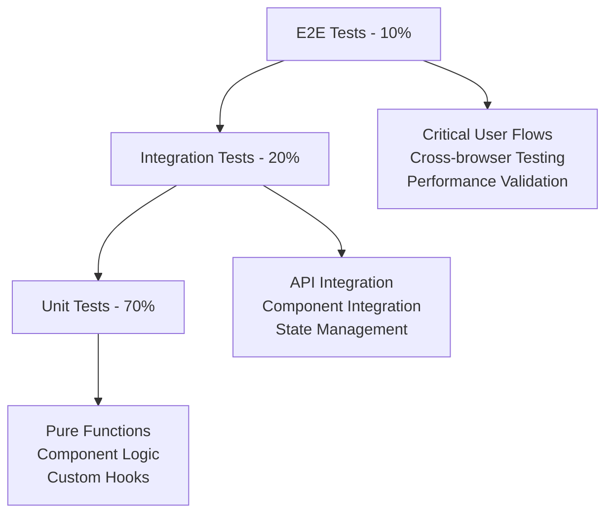

# EcoSprout Testing Strategy & Implementation Plan
*Comprehensive Testing Framework for React/Next.js 15 Carbon Credit Platform*

---

## Table of Contents

1. [Testing Philosophy](#testing-philosophy)
2. [Testing Pyramid Strategy](#testing-pyramid-strategy)
3. [Testing Tools & Setup](#testing-tools--setup)
4. [Unit Testing Strategy](#unit-testing-strategy)
5. [Integration Testing](#integration-testing)
6. [End-to-End Testing](#end-to-end-testing)
7. [Visual Regression Testing](#visual-regression-testing)
8. [Performance Testing](#performance-testing)
9. [Accessibility Testing](#accessibility-testing)
10. [Test Organization](#test-organization)
11. [CI/CD Testing Pipeline](#cicd-testing-pipeline)
12. [Implementation Timeline](#implementation-timeline)

---

## Testing Philosophy

### Core Principles

#### 1. **Test Confidence Over Coverage**
- Focus on testing critical user flows and business logic
- Prioritize integration tests over isolated unit tests
- Test behavior, not implementation details
- Aim for 80% meaningful coverage rather than 100% superficial coverage

#### 2. **User-Centric Testing**
- Test from the user's perspective
- Use accessible queries (roles, labels, text content)
- Test real user scenarios and edge cases
- Ensure tests reflect actual usage patterns

#### 3. **Fast Feedback Loop**
- Unit tests should run in < 10 seconds
- Integration tests should complete in < 2 minutes
- E2E tests should provide feedback within 10 minutes
- Failed tests should provide clear, actionable error messages

#### 4. **Maintainable Test Suite**
- Tests should be easy to understand and modify
- Minimize test coupling and duplication
- Use descriptive test names and clear assertions
- Regularly refactor and clean up test code

---

## Testing Pyramid Strategy

### Testing Distribution



### Test Categories by Dashboard

#### 1. **Project Creator Dashboard**
```typescript
// High Priority Tests (Must Have)
- Project creation wizard flow
- Progress report submission
- Revenue tracking accuracy
- Document upload functionality
- Verification status updates

// Medium Priority Tests (Should Have)
- Dashboard metrics calculations
- Project filtering and sorting
- Real-time notifications
- Export functionality

// Low Priority Tests (Nice to Have)
- UI animations and transitions
- Theme switching
- Mobile responsive layouts
```

#### 2. **Credit Buyer Dashboard**
```typescript
// High Priority Tests (Must Have)
- Credit purchase flow
- Payment processing
- Certificate generation
- Portfolio tracking
- Impact calculations

// Medium Priority Tests (Should Have)
- Marketplace search and filters
- Wishlist functionality
- Purchase history
- Impact visualizations

// Low Priority Tests (Nice to Have)
- Advanced filtering options
- Comparison tools
- Social sharing features
```

#### 3. **Verifier Dashboard**
```typescript
// High Priority Tests (Must Have)
- Document review workflow
- Verification checklist completion
- Approval/rejection process
- Quality scoring system
- Communication threads

// Medium Priority Tests (Should Have)
- Queue management
- Performance analytics
- Deadline tracking
- Batch operations

// Low Priority Tests (Nice to Have)
- Advanced annotation tools
- Report generation
- Performance comparisons
```

#### 4. **Admin Dashboard**
```typescript
// High Priority Tests (Must Have)
- User management operations
- System monitoring alerts
- Platform analytics accuracy
- Security configurations
- Audit trail logging

// Medium Priority Tests (Should Have)
- Bulk operations
- Report exports
- Configuration management
- Support ticket handling

// Low Priority Tests (Nice to Have)
- Advanced analytics views
- Custom dashboard layouts
- System performance tuning
```

---

## Testing Tools & Setup

### Tool Selection

#### 1. **Testing Framework**
```json
{
  "testFramework": "Vitest",
  "rationale": "Fast, Vite-native, ESM support, TypeScript ready",
  "alternatives": ["Jest", "Mocha"],
  "configuration": {
    "environment": "jsdom",
    "setupFiles": ["./src/test/setup.ts"],
    "coverage": {
      "provider": "v8",
      "reporter": ["text", "json", "html"]
    }
  }
}
```

#### 2. **React Testing Library**
```json
{
  "library": "@testing-library/react",
  "rationale": "User-centric testing, good practices enforcement",
  "extensions": [
    "@testing-library/jest-dom",
    "@testing-library/user-event"
  ]
}
```

#### 3. **E2E Testing**
```json
{
  "tool": "Playwright",
  "rationale": "Multi-browser support, reliable selectors, parallel execution",
  "configuration": {
    "browsers": ["chromium", "firefox", "webkit"],
    "headless": true,
    "workers": 4
  }
}
```

#### 4. **Visual Testing**
```json
{
  "tool": "Chromatic (Storybook)",
  "rationale": "Component isolation, visual regression detection",
  "alternatives": ["Percy", "Applitools"]
}
```

### Test Environment Setup

#### 1. **Vitest Configuration**
```typescript
// vitest.config.ts
import { defineConfig } from 'vitest/config';
import react from '@vitejs/plugin-react';
import path from 'path';

export default defineConfig({
  plugins: [react()],
  test: {
    environment: 'jsdom',
    setupFiles: ['./src/test/setup.ts'],
    globals: true,
    css: true,
    coverage: {
      provider: 'v8',
      reporter: ['text', 'json', 'html'],
      exclude: [
        'node_modules/',
        'src/test/',
        '**/*.d.ts',
        '**/*.stories.tsx',
        '**/types/',
        'src/components/ui/' // shadcn components
      ],
      thresholds: {
        global: {
          branches: 70,
          functions: 70,
          lines: 70,
          statements: 70
        }
      }
    }
  },
  resolve: {
    alias: {
      '@': path.resolve(__dirname, './src')
    }
  }
});
```

#### 2. **Test Setup File**
```typescript
// src/test/setup.ts
import '@testing-library/jest-dom';
import { vi } from 'vitest';

// Mock Next.js router
vi.mock('next/router', () => ({
  useRouter: () => ({
    push: vi.fn(),
    replace: vi.fn(),
    pathname: '/',
    query: {},
    asPath: '/'
  })
}));

// Mock Next.js image
vi.mock('next/image', () => ({
  default: ({ src, alt, ...props }: any) => (
    
  )
}));

// Mock IntersectionObserver
global.IntersectionObserver = vi.fn().mockImplementation(() => ({
  observe: vi.fn(),
  unobserve: vi.fn(),
  disconnect: vi.fn()
}));

// Mock ResizeObserver
global.ResizeObserver = vi.fn().mockImplementation(() => ({
  observe: vi.fn(),
  unobserve: vi.fn(),
  disconnect: vi.fn()
}));

// Mock matchMedia
Object.defineProperty(window, 'matchMedia', {
  writable: true,
  value: vi.fn().mockImplementation(query => ({
    matches: false,
    media: query,
    onchange: null,
    addListener: vi.fn(),
    removeListener: vi.fn(),
    addEventListener: vi.fn(),
    removeEventListener: vi.fn(),
    dispatchEvent: vi.fn()
  }))
});
```

---

## Unit Testing Strategy

### Component Testing Patterns

#### 1. **Basic Component Testing**
```typescript
// components/ui/Button.test.tsx
import { render, screen, fireEvent } from '@testing-library/react';
import { vi } from 'vitest';
import { Button } from './Button';

describe('Button Component', () => {
  it('renders with correct text', () => {
    render(<Button>Click me</Button>);

    expect(screen.getByRole('button', { name: 'Click me' }))
      .toBeInTheDocument();
  });

  it('applies variant classes correctly', () => {
    render(<Button variant="secondary">Secondary</Button>);

    expect(screen.getByRole('button'))
      .toHaveClass('bg-mountain-meadow');
  });

  it('handles click events', () => {
    const handleClick = vi.fn();
    render(<Button onClick={handleClick}>Click me</Button>);

    fireEvent.click(screen.getByRole('button'));
    expect(handleClick).toHaveBeenCalledTimes(1);
  });

  it('is disabled when loading', () => {
    render(<Button loading>Loading</Button>);

    const button = screen.getByRole('button');
    expect(button).toBeDisabled();
    expect(button).toHaveAttribute('aria-busy', 'true');
  });

  it('supports keyboard navigation', () => {
    const handleClick = vi.fn();
    render(<Button onClick={handleClick}>Click me</Button>);

    const button = screen.getByRole('button');
    fireEvent.keyDown(button, { key: 'Enter' });
    expect(handleClick).toHaveBeenCalledTimes(1);
  });
});
```

#### 2. **Complex Component Testing**
```typescript
// components/dashboard/MetricCard.test.tsx
import { render, screen } from '@testing-library/react';
import { TrendingUp } from 'lucide-react';
import { MetricCard } from './MetricCard';

const defaultProps = {
  title: 'Total Credits',
  value: '1,234',
  icon: TrendingUp
};

describe('MetricCard Component', () => {
  it('displays metric information correctly', () => {
    render(<MetricCard {...defaultProps} />);

    expect(screen.getByText('Total Credits')).toBeInTheDocument();
    expect(screen.getByText('1,234')).toBeInTheDocument();
    expect(screen.getByTestId('trending-up-icon')).toBeInTheDocument();
  });

  it('shows positive change indicator', () => {
    render(
      <MetricCard
        {...defaultProps}
        change="+15%"
        changeType="positive"
      />
    );

    const change = screen.getByText('+15%');
    expect(change).toBeInTheDocument();
    expect(change).toHaveClass('text-mountain-meadow');
  });

  it('shows negative change indicator', () => {
    render(
      <MetricCard
        {...defaultProps}
        change="-5%"
        changeType="negative"
      />
    );

    const change = screen.getByText('-5%');
    expect(change).toBeInTheDocument();
    expect(change).toHaveClass('text-red-600');
  });

  it('displays loading skeleton when loading', () => {
    render(<MetricCard {...defaultProps} loading />);

    expect(screen.getByTestId('metric-card-skeleton')).toBeInTheDocument();
    expect(screen.queryByText('Total Credits')).not.toBeInTheDocument();
  });

  it('applies custom className', () => {
    render(<MetricCard {...defaultProps} className="custom-class" />);

    expect(screen.getByTestId('metric-card')).toHaveClass('custom-class');
  });
});
```

### Custom Hook Testing

#### 1. **Data Fetching Hooks**
```typescript
// hooks/api/useProjects.test.ts
import { renderHook, waitFor } from '@testing-library/react';
import { QueryClient, QueryClientProvider } from '@tanstack/react-query';
import { http, HttpResponse } from 'msw';
import { setupServer } from 'msw/node';
import { useProjects } from './useProjects';

const server = setupServer(
  http.get('/api/projects', () => {
    return HttpResponse.json([
      { id: '1', name: 'Project 1', status: 'active' },
      { id: '2', name: 'Project 2', status: 'pending' }
    ]);
  })
);

beforeAll(() => server.listen());
afterEach(() => server.resetHandlers());
afterAll(() => server.close());

const createWrapper = () => {
  const queryClient = new QueryClient({
    defaultOptions: {
      queries: { retry: false },
      mutations: { retry: false }
    }
  });

  return ({ children }: { children: React.ReactNode }) => (
    <QueryClientProvider client={queryClient}>
      {children}
    </QueryClientProvider>
  );
};

describe('useProjects Hook', () => {
  it('fetches projects successfully', async () => {
    const { result } = renderHook(() => useProjects(), {
      wrapper: createWrapper()
    });

    expect(result.current.isLoading).toBe(true);

    await waitFor(() => {
      expect(result.current.isSuccess).toBe(true);
    });

    expect(result.current.data).toHaveLength(2);
    expect(result.current.data?.[0]).toMatchObject({
      id: '1',
      name: 'Project 1',
      status: 'active'
    });
  });

  it('handles API errors', async () => {
    server.use(
      http.get('/api/projects', () => {
        return new HttpResponse(null, { status: 500 });
      })
    );

    const { result } = renderHook(() => useProjects(), {
      wrapper: createWrapper()
    });

    await waitFor(() => {
      expect(result.current.isError).toBe(true);
    });

    expect(result.current.error).toBeDefined();
  });

  it('applies filters correctly', async () => {
    const filters = { type: 'reforestation', status: 'active' };

    server.use(
      http.get('/api/projects', ({ request }) => {
        const url = new URL(request.url);
        expect(url.searchParams.get('type')).toBe('reforestation');
        expect(url.searchParams.get('status')).toBe('active');

        return HttpResponse.json([]);
      })
    );

    const { result } = renderHook(() => useProjects(filters), {
      wrapper: createWrapper()
    });

    await waitFor(() => {
      expect(result.current.isSuccess).toBe(true);
    });
  });
});
```

#### 2. **State Management Hooks**
```typescript
// hooks/ui/useLocalStorage.test.ts
import { renderHook, act } from '@testing-library/react';
import { useLocalStorage } from './useLocalStorage';

// Mock localStorage
const localStorageMock = (() => {
  let store: Record<string, string> = {};

  return {
    getItem: vi.fn((key: string) => store[key] || null),
    setItem: vi.fn((key: string, value: string) => {
      store[key] = value;
    }),
    removeItem: vi.fn((key: string) => {
      delete store[key];
    }),
    clear: vi.fn(() => {
      store = {};
    })
  };
})();

Object.defineProperty(window, 'localStorage', {
  value: localStorageMock
});

describe('useLocalStorage Hook', () => {
  beforeEach(() => {
    localStorageMock.clear();
    vi.clearAllMocks();
  });

  it('returns initial value when localStorage is empty', () => {
    const { result } = renderHook(() =>
      useLocalStorage('test-key', 'initial')
    );

    expect(result.current[0]).toBe('initial');
    expect(localStorageMock.getItem).toHaveBeenCalledWith('test-key');
  });

  it('returns stored value from localStorage', () => {
    localStorageMock.setItem('test-key', '"stored"');

    const { result } = renderHook(() =>
      useLocalStorage('test-key', 'initial')
    );

    expect(result.current[0]).toBe('stored');
  });

  it('updates localStorage when value changes', () => {
    const { result } = renderHook(() =>
      useLocalStorage('test-key', 'initial')
    );

    act(() => {
      result.current[1]('updated');
    });

    expect(result.current[0]).toBe('updated');
    expect(localStorageMock.setItem).toHaveBeenCalledWith(
      'test-key',
      '"updated"'
    );
  });

  it('handles complex objects', () => {
    const complexObject = { name: 'Test', values: [1, 2, 3] };

    const { result } = renderHook(() =>
      useLocalStorage('test-key', {})
    );

    act(() => {
      result.current[1](complexObject);
    });

    expect(result.current[0]).toEqual(complexObject);
    expect(localStorageMock.setItem).toHaveBeenCalledWith(
      'test-key',
      JSON.stringify(complexObject)
    );
  });

  it('handles localStorage errors gracefully', () => {
    const consoleSpy = vi.spyOn(console, 'error').mockImplementation(() => {});
    localStorageMock.setItem.mockImplementation(() => {
      throw new Error('Storage quota exceeded');
    });

    const { result } = renderHook(() =>
      useLocalStorage('test-key', 'initial')
    );

    act(() => {
      result.current[1]('new-value');
    });

    expect(consoleSpy).toHaveBeenCalledWith(
      'Error saving to localStorage:',
      expect.any(Error)
    );
    expect(result.current[0]).toBe('initial'); // Should retain current value

    consoleSpy.mockRestore();
  });
});
```

### Utility Function Testing

#### 1. **Pure Function Testing**
```typescript
// lib/formatters.test.ts
import {
  formatCurrency,
  formatNumber,
  formatPercentage,
  formatDate,
  formatRelativeTime
} from './formatters';

describe('Formatter Utilities', () => {
  describe('formatCurrency', () => {
    it('formats USD currency correctly', () => {
      expect(formatCurrency(1234.56, 'USD')).toBe('$1,234.56');
      expect(formatCurrency(0, 'USD')).toBe('$0.00');
      expect(formatCurrency(-100, 'USD')).toBe('-$100.00');
    });

    it('formats different currencies', () => {
      expect(formatCurrency(1234.56, 'EUR')).toBe('€1,234.56');
      expect(formatCurrency(1234.56, 'GBP')).toBe('£1,234.56');
    });

    it('handles large numbers', () => {
      expect(formatCurrency(1234567.89, 'USD')).toBe('$1,234,567.89');
    });

    it('respects decimal places', () => {
      expect(formatCurrency(123.456, 'USD', 0)).toBe('$123');
      expect(formatCurrency(123.456, 'USD', 3)).toBe('$123.456');
    });
  });

  describe('formatNumber', () => {
    it('formats numbers with commas', () => {
      expect(formatNumber(1234)).toBe('1,234');
      expect(formatNumber(1234567)).toBe('1,234,567');
    });

    it('handles decimal places', () => {
      expect(formatNumber(1234.56, 1)).toBe('1,234.6');
      expect(formatNumber(1234.56, 3)).toBe('1,234.560');
    });

    it('formats zero correctly', () => {
      expect(formatNumber(0)).toBe('0');
    });
  });

  describe('formatPercentage', () => {
    it('formats percentages correctly', () => {
      expect(formatPercentage(0.1534)).toBe('15.34%');
      expect(formatPercentage(0.5)).toBe('50%');
      expect(formatPercentage(1.2345)).toBe('123.45%');
    });

    it('handles negative percentages', () => {
      expect(formatPercentage(-0.15)).toBe('-15%');
    });

    it('respects decimal places', () => {
      expect(formatPercentage(0.1234, 1)).toBe('12.3%');
      expect(formatPercentage(0.1234, 3)).toBe('12.340%');
    });
  });

  describe('formatDate', () => {
    it('formats dates correctly', () => {
      const date = new Date('2023-12-25T10:30:00Z');
      expect(formatDate(date)).toBe('Dec 25, 2023');
    });

    it('handles different formats', () => {
      const date = new Date('2023-12-25T10:30:00Z');
      expect(formatDate(date, 'full')).toBe('Monday, December 25, 2023');
      expect(formatDate(date, 'short')).toBe('12/25/23');
    });
  });

  describe('formatRelativeTime', () => {
    beforeEach(() => {
      vi.useFakeTimers();
      vi.setSystemTime(new Date('2023-12-25T12:00:00Z'));
    });

    afterEach(() => {
      vi.useRealTimers();
    });

    it('formats relative time correctly', () => {
      const now = new Date('2023-12-25T12:00:00Z');
      const oneHourAgo = new Date('2023-12-25T11:00:00Z');
      const oneDayAgo = new Date('2023-12-24T12:00:00Z');

      expect(formatRelativeTime(oneHourAgo)).toBe('1 hour ago');
      expect(formatRelativeTime(oneDayAgo)).toBe('1 day ago');
    });

    it('handles future dates', () => {
      const oneHourFromNow = new Date('2023-12-25T13:00:00Z');
      expect(formatRelativeTime(oneHourFromNow)).toBe('in 1 hour');
    });
  });
});
```

---

## Integration Testing

### Component Integration Testing

#### 1. **Form Integration Testing**
```typescript
// components/forms/ProjectForm.test.tsx
import { render, screen, fireEvent, waitFor } from '@testing-library/react';
import userEvent from '@testing-library/user-event';
import { QueryClient, QueryClientProvider } from '@tanstack/react-query';
import { http, HttpResponse } from 'msw';
import { setupServer } from 'msw/node';
import { ProjectForm } from './ProjectForm';

const server = setupServer(
  http.post('/api/projects', async ({ request }) => {
    const body = await request.json();
    return HttpResponse.json({
      id: 'new-project-id',
      ...body,
      status: 'draft'
    });
  })
);

beforeAll(() => server.listen());
afterEach(() => server.resetHandlers());
afterAll(() => server.close());

const renderProjectForm = () => {
  const queryClient = new QueryClient({
    defaultOptions: { queries: { retry: false } }
  });

  const mockOnSuccess = vi.fn();

  return {
    mockOnSuccess,
    ...render(
      <QueryClientProvider client={queryClient}>
        <ProjectForm onSuccess={mockOnSuccess} />
      </QueryClientProvider>
    )
  };
};

describe('ProjectForm Integration', () => {
  it('submits form with valid data', async () => {
    const user = userEvent.setup();
    const { mockOnSuccess } = renderProjectForm();

    // Fill out form fields
    await user.type(
      screen.getByLabelText(/project name/i),
      'Test Reforestation Project'
    );

    await user.type(
      screen.getByLabelText(/description/i),
      'A comprehensive reforestation project aimed at offsetting carbon emissions through sustainable tree planting initiatives.'
    );

    await user.selectOptions(
      screen.getByLabelText(/project type/i),
      'reforestation'
    );

    await user.type(
      screen.getByLabelText(/estimated credits/i),
      '1000'
    );

    await user.type(
      screen.getByLabelText(/price per credit/i),
      '25.50'
    );

    // Submit form
    await user.click(screen.getByRole('button', { name: /create project/i }));

    // Wait for submission
    await waitFor(() => {
      expect(mockOnSuccess).toHaveBeenCalledWith(
        expect.objectContaining({
          id: 'new-project-id',
          name: 'Test Reforestation Project'
        })
      );
    });
  });

  it('displays validation errors for invalid data', async () => {
    const user = userEvent.setup();
    renderProjectForm();

    // Try to submit empty form
    await user.click(screen.getByRole('button', { name: /create project/i }));

    // Check for validation errors
    await waitFor(() => {
      expect(screen.getByText(/project name is required/i)).toBeInTheDocument();
      expect(screen.getByText(/description is required/i)).toBeInTheDocument();
    });
  });

  it('handles API errors gracefully', async () => {
    server.use(
      http.post('/api/projects', () => {
        return new HttpResponse(null, { status: 500 });
      })
    );

    const user = userEvent.setup();
    renderProjectForm();

    // Fill out minimal valid form
    await user.type(
      screen.getByLabelText(/project name/i),
      'Test Project'
    );

    await user.type(
      screen.getByLabelText(/description/i),
      'A test project description that meets the minimum requirements.'
    );

    await user.click(screen.getByRole('button', { name: /create project/i }));

    // Check for error message
    await waitFor(() => {
      expect(screen.getByText(/failed to create project/i)).toBeInTheDocument();
    });
  });

  it('saves draft when user navigates away', async () => {
    const user = userEvent.setup();
    renderProjectForm();

    // Fill out partial form
    await user.type(
      screen.getByLabelText(/project name/i),
      'Draft Project'
    );

    // Simulate navigation away (blur event)
    fireEvent.blur(screen.getByLabelText(/project name/i));

    // Check that draft is saved to localStorage
    await waitFor(() => {
      const savedDraft = localStorage.getItem('project-form-draft');
      expect(savedDraft).toBeTruthy();

      const parsed = JSON.parse(savedDraft!);
      expect(parsed.name).toBe('Draft Project');
    });
  });
});
```

#### 2. **Dashboard Integration Testing**
```typescript
// pages/creator/Dashboard.test.tsx
import { render, screen, waitFor } from '@testing-library/react';
import { QueryClient, QueryClientProvider } from '@tanstack/react-query';
import { http, HttpResponse } from 'msw';
import { setupServer } from 'msw/node';
import { CreatorDashboard } from './Dashboard';

const mockDashboardData = {
  overview: {
    activeProjects: 5,
    totalCredits: 12500,
    creditsSold: 8750,
    totalRevenue: 218750,
    pendingVerifications: 2
  },
  projects: [
    {
      id: '1',
      name: 'Forest Conservation Project',
      status: 'active',
      progress: 75,
      revenue: 125000
    }
  ],
  recentActivity: [
    {
      id: '1',
      type: 'project_approved',
      title: 'Project Approved',
      description: 'Forest Conservation Project has been approved',
      timestamp: new Date().toISOString()
    }
  ]
};

const server = setupServer(
  http.get('/api/creator/dashboard', () => {
    return HttpResponse.json(mockDashboardData);
  })
);

beforeAll(() => server.listen());
afterEach(() => server.resetHandlers());
afterAll(() => server.close());

const renderDashboard = () => {
  const queryClient = new QueryClient({
    defaultOptions: { queries: { retry: false } }
  });

  return render(
    <QueryClientProvider client={queryClient}>
      <CreatorDashboard />
    </QueryClientProvider>
  );
};

describe('Creator Dashboard Integration', () => {
  it('loads and displays dashboard data', async () => {
    renderDashboard();

    // Check loading state
    expect(screen.getByTestId('dashboard-loading')).toBeInTheDocument();

    // Wait for data to load
    await waitFor(() => {
      expect(screen.getByText('5')).toBeInTheDocument(); // Active projects
      expect(screen.getByText('12,500')).toBeInTheDocument(); // Total credits
      expect(screen.getByText('$218,750')).toBeInTheDocument(); // Revenue
    });

    // Check project list
    expect(screen.getByText('Forest Conservation Project')).toBeInTheDocument();

    // Check activity feed
    expect(screen.getByText('Project Approved')).toBeInTheDocument();
  });

  it('handles loading state correctly', () => {
    // Delay the API response
    server.use(
      http.get('/api/creator/dashboard', async () => {
        await new Promise(resolve => setTimeout(resolve, 100));
        return HttpResponse.json(mockDashboardData);
      })
    );

    renderDashboard();

    expect(screen.getByTestId('dashboard-loading')).toBeInTheDocument();
    expect(screen.queryByText('Active Projects')).not.toBeInTheDocument();
  });

  it('handles API errors gracefully', async () => {
    server.use(
      http.get('/api/creator/dashboard', () => {
        return new HttpResponse(null, { status: 500 });
      })
    );

    renderDashboard();

    await waitFor(() => {
      expect(screen.getByText(/failed to load dashboard/i)).toBeInTheDocument();
      expect(screen.getByRole('button', { name: /retry/i })).toBeInTheDocument();
    });
  });

  it('refreshes data when retry button is clicked', async () => {
    // First request fails
    server.use(
      http.get('/api/creator/dashboard', () => {
        return new HttpResponse(null, { status: 500 });
      })
    );

    renderDashboard();

    await waitFor(() => {
      expect(screen.getByText(/failed to load dashboard/i)).toBeInTheDocument();
    });

    // Second request succeeds
    server.use(
      http.get('/api/creator/dashboard', () => {
        return HttpResponse.json(mockDashboardData);
      })
    );

    fireEvent.click(screen.getByRole('button', { name: /retry/i }));

    await waitFor(() => {
      expect(screen.getByText('5')).toBeInTheDocument();
    });
  });
});
```

---

## End-to-End Testing

### Playwright Configuration

#### 1. **Playwright Setup**
```typescript
// playwright.config.ts
import { defineConfig, devices } from '@playwright/test';

export default defineConfig({
  testDir: './e2e',
  fullyParallel: true,
  forbidOnly: !!process.env.CI,
  retries: process.env.CI ? 2 : 0,
  workers: process.env.CI ? 1 : undefined,
  reporter: [
    ['html'],
    ['junit', { outputFile: 'test-results/junit.xml' }]
  ],
  use: {
    baseURL: 'http://localhost:3000',
    trace: 'on-first-retry',
    screenshot: 'only-on-failure'
  },

  projects: [
    {
      name: 'chromium',
      use: { ...devices['Desktop Chrome'] }
    },
    {
      name: 'firefox',
      use: { ...devices['Desktop Firefox'] }
    },
    {
      name: 'webkit',
      use: { ...devices['Desktop Safari'] }
    },
    {
      name: 'Mobile Chrome',
      use: { ...devices['Pixel 5'] }
    },
    {
      name: 'Mobile Safari',
      use: { ...devices['iPhone 12'] }
    }
  ],

  webServer: {
    command: 'npm run dev',
    url: 'http://localhost:3000',
    reuseExistingServer: !process.env.CI
  }
});
```

#### 2. **E2E Test Utilities**
```typescript
// e2e/utils/test-helpers.ts
import { Page, expect } from '@playwright/test';

export class TestHelpers {
  constructor(private page: Page) {}

  async login(email: string = 'creator@example.com', password: string = 'password') {
    await this.page.goto('/login');
    await this.page.fill('[data-testid="email"]', email);
    await this.page.fill('[data-testid="password"]', password);
    await this.page.click('[data-testid="login-button"]');
    await this.page.waitForURL('**/dashboard');
  }

  async waitForDashboardLoad() {
    await this.page.waitForSelector('[data-testid="dashboard-metrics"]');
    await this.page.waitForLoadState('networkidle');
  }

  async fillProjectForm(projectData: {
    name: string;
    description: string;
    type: string;
    credits: string;
    price: string;
  }) {
    await this.page.fill('[data-testid="project-name"]', projectData.name);
    await this.page.fill('[data-testid="project-description"]', projectData.description);
    await this.page.selectOption('[data-testid="project-type"]', projectData.type);
    await this.page.fill('[data-testid="estimated-credits"]', projectData.credits);
    await this.page.fill('[data-testid="price-per-credit"]', projectData.price);
  }

  async expectToast(message: string) {
    await expect(this.page.locator('[data-testid="toast"]')).toContainText(message);
  }

  async mockApiResponse(endpoint: string, response: any) {
    await this.page.route(`**/api${endpoint}`, route => {
      route.fulfill({
        status: 200,
        contentType: 'application/json',
        body: JSON.stringify(response)
      });
    });
  }
}
```

### Critical User Flow Tests

#### 1. **Project Creation Flow**
```typescript
// e2e/project-creation.spec.ts
import { test, expect } from '@playwright/test';
import { TestHelpers } from './utils/test-helpers';

test.describe('Project Creation Flow', () => {
  test('complete project creation wizard', async ({ page }) => {
    const helpers = new TestHelpers(page);

    // Login as project creator
    await helpers.login('creator@example.com');
    await helpers.waitForDashboardLoad();

    // Navigate to create project
    await page.click('[data-testid="create-project-button"]');
    await page.waitForURL('**/projects/new');

    // Step 1: Basic Information
    await helpers.fillProjectForm({
      name: 'Test Forest Project',
      description: 'A comprehensive reforestation project that will plant native trees to offset carbon emissions and restore biodiversity in the region.',
      type: 'reforestation',
      credits: '1000',
      price: '25.50'
    });

    await page.click('[data-testid="next-button"]');

    // Step 2: Location & Timeline
    await page.selectOption('[data-testid="country"]', 'US');
    await page.selectOption('[data-testid="state"]', 'CA');
    await page.fill('[data-testid="city"]', 'Los Angeles');
    await page.fill('[data-testid="start-date"]', '2024-01-01');
    await page.fill('[data-testid="end-date"]', '2026-12-31');

    await page.click('[data-testid="next-button"]');

    // Step 3: Environmental Impact
    await page.fill('[data-testid="co2-reduction"]', '1000');
    await page.fill('[data-testid="area-size"]', '100');
    await page.selectOption('[data-testid="methodology"]', 'VCS');

    await page.click('[data-testid="next-button"]');

    // Step 4: Documentation
    await page.setInputFiles(
      '[data-testid="project-plan-upload"]',
      'e2e/fixtures/project-plan.pdf'
    );

    await page.setInputFiles(
      '[data-testid="environmental-impact-upload"]',
      'e2e/fixtures/environmental-impact.pdf'
    );

    await page.click('[data-testid="next-button"]');

    // Step 5: Review & Submit
    await expect(page.locator('[data-testid="review-project-name"]'))
      .toContainText('Test Forest Project');

    await expect(page.locator('[data-testid="review-credits"]'))
      .toContainText('1,000');

    await page.click('[data-testid="submit-project-button"]');

    // Verify submission success
    await helpers.expectToast('Project submitted for verification');
    await page.waitForURL('**/projects');

    // Verify project appears in list
    await expect(page.locator('[data-testid="project-list"]'))
      .toContainText('Test Forest Project');
  });

  test('validates required fields', async ({ page }) => {
    const helpers = new TestHelpers(page);

    await helpers.login('creator@example.com');
    await page.goto('/creator/projects/new');

    // Try to proceed without filling required fields
    await page.click('[data-testid="next-button"]');

    // Check for validation errors
    await expect(page.locator('[data-testid="error-project-name"]'))
      .toContainText('Project name is required');

    await expect(page.locator('[data-testid="error-description"]'))
      .toContainText('Description must be at least 50 characters');
  });

  test('saves draft automatically', async ({ page }) => {
    const helpers = new TestHelpers(page);

    await helpers.login('creator@example.com');
    await page.goto('/creator/projects/new');

    // Fill partial form
    await page.fill('[data-testid="project-name"]', 'Draft Project');

    // Navigate away
    await page.goto('/creator/dashboard');

    // Return to form
    await page.goto('/creator/projects/new');

    // Verify draft is restored
    await expect(page.locator('[data-testid="project-name"]'))
      .toHaveValue('Draft Project');

    await expect(page.locator('[data-testid="draft-indicator"]'))
      .toBeVisible();
  });
});
```

#### 2. **Credit Purchase Flow**
```typescript
// e2e/credit-purchase.spec.ts
import { test, expect } from '@playwright/test';
import { TestHelpers } from './utils/test-helpers';

test.describe('Credit Purchase Flow', () => {
  test('complete credit purchase', async ({ page }) => {
    const helpers = new TestHelpers(page);

    // Mock payment processing
    await helpers.mockApiResponse('/payments/process', {
      success: true,
      transactionId: 'txn_123',
      certificateUrl: '/certificates/cert_123.pdf'
    });

    // Login as credit buyer
    await helpers.login('buyer@example.com');
    await page.goto('/buyer/marketplace');

    // Browse and select project
    await page.click('[data-testid="project-card"]:first-child');
    await page.waitForURL('**/projects/**');

    // Verify project details
    await expect(page.locator('[data-testid="project-title"]')).toBeVisible();
    await expect(page.locator('[data-testid="credits-available"]')).toBeVisible();

    // Click purchase button
    await page.click('[data-testid="purchase-button"]');

    // Purchase modal should open
    await expect(page.locator('[data-testid="purchase-modal"]')).toBeVisible();

    // Enter purchase details
    await page.fill('[data-testid="credit-quantity"]', '100');

    // Verify total calculation
    await expect(page.locator('[data-testid="total-cost"]'))
      .toContainText('$2,550.00'); // 100 * $25.50

    // Enter payment information
    await page.fill('[data-testid="card-number"]', '4242424242424242');
    await page.fill('[data-testid="card-expiry"]', '12/25');
    await page.fill('[data-testid="card-cvc"]', '123');
    await page.fill('[data-testid="card-name"]', 'John Doe');

    // Enter billing address
    await page.fill('[data-testid="billing-address"]', '123 Main St');
    await page.fill('[data-testid="billing-city"]', 'San Francisco');
    await page.selectOption('[data-testid="billing-state"]', 'CA');
    await page.fill('[data-testid="billing-zip"]', '94105');

    // Complete purchase
    await page.click('[data-testid="complete-purchase-button"]');

    // Verify purchase success
    await helpers.expectToast('Credits purchased successfully!');

    // Verify navigation to portfolio
    await page.waitForURL('**/buyer/portfolio');

    // Verify purchase appears in portfolio
    await expect(page.locator('[data-testid="recent-purchase"]'))
      .toContainText('100 credits');
  });

  test('validates payment form', async ({ page }) => {
    const helpers = new TestHelpers(page);

    await helpers.login('buyer@example.com');
    await page.goto('/buyer/marketplace');

    await page.click('[data-testid="project-card"]:first-child');
    await page.click('[data-testid="purchase-button"]');

    await page.fill('[data-testid="credit-quantity"]', '50');

    // Try to purchase without payment details
    await page.click('[data-testid="complete-purchase-button"]');

    // Check for validation errors
    await expect(page.locator('[data-testid="error-card-number"]'))
      .toContainText('Card number is required');

    await expect(page.locator('[data-testid="error-card-expiry"]'))
      .toContainText('Expiry date is required');
  });

  test('handles payment failures', async ({ page }) => {
    const helpers = new TestHelpers(page);

    // Mock payment failure
    await helpers.mockApiResponse('/payments/process', {
      success: false,
      error: 'Payment declined by issuer'
    });

    await helpers.login('buyer@example.com');
    await page.goto('/buyer/marketplace');

    await page.click('[data-testid="project-card"]:first-child');
    await page.click('[data-testid="purchase-button"]');

    // Fill form with valid data
    await page.fill('[data-testid="credit-quantity"]', '50');
    await page.fill('[data-testid="card-number"]', '4000000000000002'); // Declined card
    await page.fill('[data-testid="card-expiry"]', '12/25');
    await page.fill('[data-testid="card-cvc"]', '123');

    await page.click('[data-testid="complete-purchase-button"]');

    // Verify error handling
    await expect(page.locator('[data-testid="payment-error"]'))
      .toContainText('Payment declined by issuer');

    // Verify modal stays open for retry
    await expect(page.locator('[data-testid="purchase-modal"]')).toBeVisible();
  });
});
```

---

## Performance Testing

### Core Web Vitals Testing

#### 1. **Lighthouse CI Configuration**
```javascript
// lighthouserc.js
module.exports = {
  ci: {
    collect: {
      url: [
        'http://localhost:3000/',
        'http://localhost:3000/creator/dashboard',
        'http://localhost:3000/buyer/marketplace',
        'http://localhost:3000/verifier/queue'
      ],
      numberOfRuns: 3
    },
    assert: {
      assertions: {
        'categories:performance': ['warn', { minScore: 0.8 }],
        'categories:accessibility': ['error', { minScore: 0.9 }],
        'categories:best-practices': ['warn', { minScore: 0.8 }],
        'categories:seo': ['warn', { minScore: 0.8 }],
        'first-contentful-paint': ['warn', { maxNumericValue: 2000 }],
        'largest-contentful-paint': ['warn', { maxNumericValue: 3000 }],
        'cumulative-layout-shift': ['error', { maxNumericValue: 0.1 }],
        'interactive': ['warn', { maxNumericValue: 4000 }]
      }
    },
    upload: {
      target: 'filesystem',
      outputDir: './lighthouse-results'
    }
  }
};
```

#### 2. **Performance Monitoring Tests**
```typescript
// e2e/performance.spec.ts
import { test, expect } from '@playwright/test';

test.describe('Performance Tests', () => {
  test('dashboard loads within performance budget', async ({ page }) => {
    // Enable performance monitoring
    await page.goto('/creator/dashboard', { waitUntil: 'networkidle' });

    // Measure Core Web Vitals
    const metrics = await page.evaluate(() => {
      return new Promise((resolve) => {
        new PerformanceObserver((list) => {
          const entries = list.getEntries();
          const webVitals: Record<string, number> = {};

          entries.forEach((entry) => {
            if (entry.name === 'FCP') {
              webVitals.fcp = entry.value;
            } else if (entry.name === 'LCP') {
              webVitals.lcp = entry.value;
            } else if (entry.name === 'CLS') {
              webVitals.cls = entry.value;
            } else if (entry.name === 'FID') {
              webVitals.fid = entry.value;
            }
          });

          if (Object.keys(webVitals).length >= 3) {
            resolve(webVitals);
          }
        }).observe({ entryTypes: ['measure', 'layout-shift', 'event'] });

        // Fallback timeout
        setTimeout(() => resolve({}), 10000);
      });
    });

    // Assert performance thresholds
    expect(metrics.fcp).toBeLessThan(2000); // First Contentful Paint < 2s
    expect(metrics.lcp).toBeLessThan(3000); // Largest Contentful Paint < 3s
    expect(metrics.cls).toBeLessThan(0.1);  // Cumulative Layout Shift < 0.1
  });

  test('large project list renders efficiently', async ({ page }) => {
    // Mock large dataset
    await page.route('**/api/projects', route => {
      const projects = Array.from({ length: 1000 }, (_, i) => ({
        id: `project-${i}`,
        name: `Project ${i}`,
        status: 'active',
        credits: 1000,
        price: 25.50
      }));

      route.fulfill({
        status: 200,
        contentType: 'application/json',
        body: JSON.stringify(projects)
      });
    });

    const startTime = Date.now();
    await page.goto('/buyer/marketplace');

    // Wait for virtual list to render
    await page.waitForSelector('[data-testid="project-list"]');

    const loadTime = Date.now() - startTime;
    expect(loadTime).toBeLessThan(3000); // Should load within 3 seconds

    // Verify only visible items are rendered (virtual scrolling)
    const renderedItems = await page.locator('[data-testid="project-card"]').count();
    expect(renderedItems).toBeLessThan(50); // Only visible items rendered
  });

  test('bundle size is within limits', async ({ page }) => {
    // Collect network requests
    const requests: any[] = [];
    page.on('request', request => {
      if (request.url().includes('.js') || request.url().includes('.css')) {
        requests.push({
          url: request.url(),
          resourceType: request.resourceType()
        });
      }
    });

    await page.goto('/creator/dashboard');
    await page.waitForLoadState('networkidle');

    // Calculate total bundle size
    const responses = await Promise.all(
      requests.map(req => page.request.get(req.url))
    );

    let totalSize = 0;
    for (const response of responses) {
      if (response.ok()) {
        const buffer = await response.body();
        totalSize += buffer.length;
      }
    }

    // Assert bundle size limits
    expect(totalSize).toBeLessThan(5 * 1024 * 1024); // < 5MB total

    // Check for large individual files
    const largeFiles = responses.filter(async (response) => {
      if (response.ok()) {
        const buffer = await response.body();
        return buffer.length > 1024 * 1024; // > 1MB
      }
      return false;
    });

    expect(largeFiles.length).toBe(0); // No individual files > 1MB
  });
});
```

---

## Implementation Timeline

### 8-Week Testing Implementation Plan

#### **Week 1-2: Foundation Setup**
- [ ] Configure testing tools (Vitest, RTL, Playwright)
- [ ] Set up test environment and utilities
- [ ] Create testing guidelines and standards
- [ ] Implement basic component tests (UI components)
- [ ] Set up MSW for API mocking

#### **Week 3-4: Unit Testing**
- [ ] Complete all utility function tests
- [ ] Implement custom hook tests
- [ ] Create component unit tests for dashboard components
- [ ] Set up state management tests (Zustand)
- [ ] Achieve 70% unit test coverage

#### **Week 5-6: Integration Testing**
- [ ] Implement form integration tests
- [ ] Create API integration tests
- [ ] Set up component integration tests
- [ ] Implement state management integration tests
- [ ] Test error boundary and error handling

#### **Week 7: E2E Testing**
- [ ] Set up Playwright configuration
- [ ] Implement critical user flow tests
- [ ] Create authentication flow tests
- [ ] Test cross-browser compatibility
- [ ] Set up visual regression testing

#### **Week 8: Performance & Optimization**
- [ ] Implement performance tests
- [ ] Set up Lighthouse CI
- [ ] Create accessibility tests
- [ ] Optimize test suite performance
- [ ] Complete CI/CD pipeline integration

### Success Metrics

#### **Coverage Targets**
- Unit Tests: 70% line coverage
- Integration Tests: 90% critical path coverage
- E2E Tests: 100% critical user flow coverage
- Performance Tests: All Core Web Vitals within budget

#### **Quality Metrics**
- Test execution time: < 10 minutes for full suite
- Flaky test rate: < 2%
- Test maintainability score: > 8/10
- False positive rate: < 5%

---

This comprehensive testing strategy ensures the EcoSprout platform maintains high quality, reliability, and performance while supporting rapid development cycles. The strategy balances thoroughness with efficiency, focusing on critical business flows and user experiences while maintaining fast feedback loops for developers.